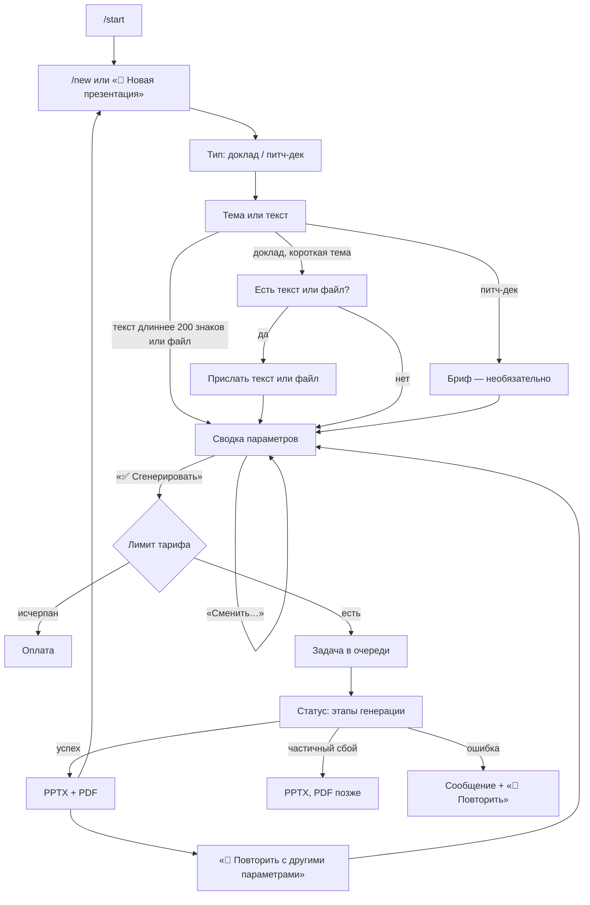

# 02. Путь пользователя (CJM)

**Статус:** утверждено 01.10.2026 (порог «тема / текст» — 200 знаков, четыре темы) · **Дата:** 30.09.2026, правка 01.10.2026 · **Опирается на:** `01_SCOPE.md`, ТЗ 3.2, 3.10, 3.11, D-008, D-023

Документ описывает, что пользователь видит на каждом шаге, какие данные при этом создаются и где хранятся, что может сломаться и что пользователь увидит тогда. Раздел 1 — бот фазы 1. Разделы 2–3 — будущие сценарии: их реализуем в фазах 3–4, но структура данных фазы 1 должна их выдержать уже сейчас.

Обозначения мест хранения:
- **PG** — PostgreSQL (`users`, `decks`, `deck_revisions` — `04_CONTRACTS.md`, 8);
- **Redis-FSM** — состояние диалога (TTL 7 дней);
- **Redis-tmp** — временные объекты: присланный файл без S3 (TTL 1 ч, D-008), прогресс колоды, кэш картинок;
- **S3** — объектное хранилище (R2 или любое S3-совместимое — Yandex Object Storage, Selectel; D-042): временные файлы пользователя (`uploads/`, удаляются после обработки) и готовые PPTX / PDF (`decks/`, 30 дней).

---

## 1. Бот, фаза 1

### 1.1 Карта шагов

### 1.2 Шаги

| # | Шаг | Что видит пользователь | Какие данные создаются и где | Что может пойти не так | Что видит пользователь тогда |
|---|---|---|---|---|---|
| 1 | `/start` | Приветствие, постоянное меню (новая презентация, профиль, тарифы, помощь) | **PG** `users`: строка создаётся или обновляется (имя, `language_code`) | БД недоступна | Бот работает без профиля: дефолты сводки не подставятся, лимит не проверится (как сейчас) — в логе ошибка |
| 2 | `/new` → тип | Кнопки «🚀 Питч-дек», «🎤 Доклад» | **Redis-FSM**: `presentation_type`, `tg_lang` | Нажата кнопка из старого сообщения | «Сессия устарела. Начнём заново» + выбор типа |
| 3 | Тема или текст | Подсказка с примером темы; можно прислать текст или файл | **Redis-FSM**: `topic`; текст > 200 знаков (вопрос 8, D-039) — `raw_text` (доклад) или `brief` (питч-дек), тема — первая строка. Файл → **S3 `uploads/`** или **Redis-tmp** (D-008), в FSM — только ссылка `document_ref` | Тема короче 3 знаков; формат не .pdf/.docx/.pptx/.txt; файл > 20 МБ; не удалось сохранить файл | Короткая понятная причина и что сделать («Пришлите .pdf, .docx, .pptx или .txt до 20 МБ»). Шаг не сбрасывается |
| 4 | Материал / бриф | Доклад: «Есть готовый текст или документ?» Питч-дек: бриф с кнопкой «Пропустить» | то же, что шаг 3 | Текст короче 20 знаков | «Слишком коротко…» — одно сообщение об ошибке, повторная ошибка правит его же (как сейчас) |
| 5 | Сводка | Одно сообщение: тема, тип, материал или бриф, режим (только при материале), язык, число слайдов (у питч-дека — фиксированные 11, без кнопки «Сменить»), аудитория, **тема оформления** (☀️ Графит светлая / 🌙 Графит тёмная / 🌊 Лазурь / 🌿 Свежая зелёная — с сессии 3; в сессиях 1–2 у нового движка одна тема), какие файлы придут (PPTX + PDF). У каждого параметра «Сменить…», внизу «✅ Сгенерировать презентацию» | **PG** чтение `users.last_*`; **Redis-FSM**: параметры, `summary_msg_id` | — (тема до 200 знаков всегда помещается на титул дословно, `05_LAYOUTS.md`, 3.1) | — |
| 6 | «✅ Сгенерировать» | Кнопки сводки исчезают; статусное сообщение «⏳ В очереди…» с номером колоды `dk_…` | **PG** `users.last_*` (прошлый выбор, D-023); **PG** `decks`: новая строка `status=queued`, `request` (все параметры, ссылка на файл). В очередь ARQ уходит только `deck_id` | Лимит бесплатного тарифа исчерпан | Экран оплаты, колода не создаётся |
| | | | | Очередь (Redis) недоступна | «Очередь генерации сейчас недоступна, попробуйте через минуту» + «🔁 Повторить». `decks.status=failed`, лимит не списан |
| 7 | Генерация | Статусное сообщение правится по этапам (не чаще раза в 3 с): «📄 Читаю материал» → «🧭 Составляю план» → «✍️ Пишу слайды: 4 из 9» → «🎨 Собираю PPTX» → «📑 Делаю PDF» | **PG** `decks`: `status=processing`, текущий этап, длительности этапов, токены, стоимость; **Redis-tmp** `deck:{id}:progress` (для API фазы 3) | см. таблицу 1.3 | см. таблицу 1.3 |
| 8 | Выдача | Два документа — PPTX и PDF — одним альбомом. Подпись: название, число слайдов, тема оформления; при необходимости — предупреждения («В материале хватило на 7 слайдов из 9», «Вошло 40 000 знаков из 62 000»). Кнопки «🔁 Повторить с другими параметрами», «🆕 Новая презентация» | **S3** `decks/{id}/deck.pptx`, `deck.pdf` (30 дней); **PG** `decks`: `status=done`, `spec` (DeckSpec), ключи файлов; `users.presentations_count += 1`; исходный файл из `uploads/` удалён | Telegram не принял файл (сеть) | 3 повтора с паузой; если не вышло — «Не удалось отправить файл» + кнопка «📤 Отправить ещё раз» (повторная отправка из S3). Лимит списывается только после успешной отправки |
| | | | | S3 не настроен или недоступен | Файлы отправляются из памяти; повторная отправка и «Повторить» без S3 работают через перерендер из `DeckSpec` (без картинок, если кэш истёк) |
| 9 | «🔁 Повторить с другими параметрами» | Сводка с параметрами прошлой колоды, всё можно поменять | **Redis-FSM** заполняется из **PG** `decks.request`. Материал берётся из сохранённого `SourceDigest` прошлой колоды (вопрос 10) — файл заново присылать не нужно. Новая колода получает `parent_deck_id` | Прошло больше 30 дней, `SourceDigest` удалён | «Материал прошлой презентации уже удалён — пришлите файл заново» и шаг 3 |

### 1.3 Что может сломаться во время генерации

| Этап | Сбой | Что делает система | Что видит пользователь |
|---|---|---|---|
| INGEST | PDF без текстового слоя (скан) | колода `failed`, код `SCAN_WITHOUT_TEXT`, лимит не списан | «В PDF нет текста (похоже на скан). Пришлите файл с текстом или вставьте текст сообщением» |
| | Файл повреждён, zip-бомба, разбор дольше 15 с | `failed`, код `BAD_FILE` / `PARSE_TIMEOUT` | «Не получилось прочитать файл. Попробуйте сохранить его заново или прислать текстом» |
| | Текст длиннее 40 000 знаков | обрабатывается начало, в `SourceDigest.truncated` — сколько отброшено | предупреждение в подписи к файлам |
| OUTLINE | 2 попытки без валидного ответа или таймаут | `failed`, код `OUTLINE_FAILED` | «Не удалось составить план презентации. Попробуйте ещё раз» + «🔁 Повторить» (те же параметры) |
| | `strict`: тезисов меньше, чем слайдов | колода короче (минимум 5) | «В материале хватило на 7 слайдов из 9 — добавьте текст, если нужно больше» |
| CONTENT | слайд не получился за 2 попытки или дедлайн этапа | слайд собирается из ключевой мысли плана как `bullets` без LLM | ничего (в логе — предупреждение) |
| | число не найдено в источнике | 1 перегенерация слайда с указанием ошибки; снова нет — число убирается, `metrics`/`chart` деградирует в `bullets` | ничего |
| IMAGES | Pexels не ответил, нет подходящего фото | вариант макета без картинки | ничего |
| FIT | текст не влезает | меньший кегль → сокращение через LLM → вариант вместительнее → обрезка по предложению | ничего (в логе — предупреждение) |
| RENDER | ошибка рендера (баг) | `failed`, код `RENDER_FAILED`, алерт в логах | «Что-то пошло не так при сборке файла. Мы уже разбираемся. Номер: dk_…» + «🔁 Повторить» |
| CONVERT | LibreOffice упал или не уложился в 30 с | PPTX отправляется сразу, PDF — отдельной задачей с одной повторной попыткой | «Вот PPTX. PDF пришлю следом через минуту». Если и повтор не удался — «PDF не получился, PPTX — полноценный файл, его можно сохранить в PDF» |
| Любой | общий дедлайн 120 с | оставшиеся этапы идут по деградации (слайды из плана, без картинок) | файлы приходят; в подписи ничего |
| Любой | воркер перезапустился посреди задачи | ARQ не ретраит; колода остаётся `processing` — сторож через 5 минут помечает её `failed` | «Генерация прервалась. Нажмите «🔁 Повторить»» (лимит не списан) |

---

## 2. Будущее: правки в боте (фаза 4, ТЗ 3.11)

Сценарий строится на том, что после генерации в **PG** лежат `DeckSpec` колоды и `SourceDigest`, а у каждого слайда хранится содержание **по смыслу kind**, а не по слотам варианта (`04_CONTRACTS.md`, 5). Поэтому смена темы и «другой вид» не требуют LLM.

| Шаг | Что видит пользователь | Данные | Что может пойти не так | Что видит тогда |
|---|---|---|---|---|
| Кнопка «✏️ Править» под файлами | Меню: «🎨 Сменить тему», «🔀 Другой вид слайда», «♻️ Перегенерировать слайд», «✂️ Короче / подробнее» | чтение **PG** `decks.spec` | колода старше 30 дней | «Эту презентацию уже нельзя править — создайте новую» |
| «🎨 Сменить тему» | Список тем → через ~10 с новые PPTX и PDF | новая ревизия: копия `DeckSpec` с другим `theme_id` → RENDER + CONVERT. **PG** `deck_revisions` (снимок + действие), `decks.revision += 1`. FIT повторяется: у тем одинаковая типошкала, но проверка обязательна | текст перестал влезать (другая тема — другие отступы карточек) | fitter сдвигает кегль или вариант; пользователь ничего не замечает |
| «🔀 Другой вид слайда» | Кнопки с номерами и короткими заголовками слайдов → выбор → новый файл | selection с исключением текущего варианта, среди вариантов того же kind, **куда содержание помещается** | подходящих вариантов нет (1 вариант у kind или всё не влезает) | «У этого слайда пока нет другого вида» |
| «♻️ Перегенерировать слайд N» | Через ~25 с новый файл | 1 вызов CONTENT для слайда N с тем же планом, `SourceDigest` и новым `seed`; FIT, проверка фактов | LLM не ответил | «Не получилось перегенерировать слайд, прежний вариант сохранён» |
| «↩️ Отменить» | Возврат к прошлой ревизии | `deck_revisions` хранит последние 10 снимков | — | — |

Стоимость правок записывается в ту же строку `decks` (накопительно) и в `deck_revisions`.

---

## 3. Будущее: API-клиент (фаза 3, ТЗ 3.10)

Второй бот вызывает REST API. Профиля у клиента нет, правок нет. Контракт — `04_CONTRACTS.md`, 7.

| Шаг | Что видит клиент | Данные | Что может пойти не так | Что видит тогда |
|---|---|---|---|---|
| `POST /v1/decks` (JSON или multipart с файлом, `Idempotency-Key`) | `202 {id, status: "queued"}` | **PG** `decks` (`api_client_id`, `idempotency_key` уникален в пределах клиента, `request`); файл → **S3 `uploads/`** | неверный ключ; превышен rate limit; повтор с тем же `Idempotency-Key` | `401`; `429` с `Retry-After`; `200` с той же колодой, вторая генерация не создаётся |
| `GET /v1/decks/{id}` | статус, текущий этап, прогресс, при `done` — подписанные ссылки на PPTX и PDF (24 ч) | чтение **PG** `decks` + **Redis-tmp** прогресс | колода чужого клиента | `404` |
| webhook | `POST` на `webhook_url` с подписью HMAC: `{id, status, files}` | — | URL клиента недоступен | 3 повтора с растущей паузой, дальше — только опрос статуса |
| Ошибка генерации | `status=failed`, `error.code` из таблицы 1.3 | `decks.error_code` | — | тот же код, что видит бот (единый справочник кодов) |

Отличия от бота, которые влияют на данные фазы 1:
- `decks.user_id` может быть пустым, если колоду создал API-клиент (`api_client_id`);
- `source_mode` по умолчанию `strict`, профиль не читается;
- прогресс этапов пишется в общем виде (Redis + `decks.stage`), а не только правкой сообщения Telegram — поэтому воркер сообщает прогресс через интерфейс, а адаптер бота превращает его в правку сообщения.
