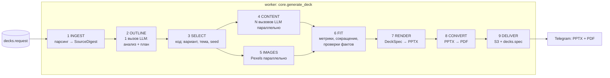

# 03. Архитектура нового движка

**Статус:** утверждено 01.10.2026 · **Дата:** 30.09.2026, правка 01.10.2026 (четыре темы, S3 любого провайдера, временная маршрутизация) · **Опирается на:** `01_SCOPE.md`, `02_CJM.md`, ТЗ 4.1–4.7, 5, D-001…D-030

---

## 1. Принципы

1. **Одна функция ядра.** `core.generate_deck(deck_id, progress) -> DeckResult`. Бот и API (с сессии 3, D-055) — тонкие адаптеры: создают строку `decks`, ставят задачу, показывают прогресс и отдают файлы. `core` не знает про Telegram и HTTP (ТЗ 4.2).
2. **DeckSpec — единственное промежуточное представление.** Все этапы после OUTLINE читают и дописывают `DeckSpec`. Рендерер рисует его как есть и ничего не решает.
3. **Числа не проходят через модель, где это возможно.** Значения диаграмм код берёт из `SourceDigest.datasets` по ссылкам плана (D-028). Модель пишет подписи и выводы.
4. **Содержание слайда хранится по смыслу kind, а не по слотам варианта.** Смена варианта или темы — без LLM (`04_CONTRACTS.md`, 5).
5. **Декларативные макеты и темы.** Вариант — `layouts/<kind>/<variant>.yaml`, тема — `themes/<id>.yaml`. Вместимость слотов в промпт подставляет код из LayoutSpec — единственный источник правды (ТЗ 4.8.3).
6. **Ни один сбой не роняет колоду молча.** Каждый этап имеет деградацию (раздел 6), общий дедлайн, и пользователь всегда получает либо файлы, либо понятное сообщение.

---

## 2. Модули и границы

```
src/
  bot/                 адаптер Telegram
    handlers.py          диалог, сводка, оплата (перенос из main.py)
    dialog.py            тексты и клавиатуры сводки (перенос как есть)
    delivery.py          прогресс-сообщение, отправка PPTX + PDF, кнопки после выдачи
  api/                 адаптер HTTP — REST API v1 (сессия 3, docs/API.md): FastAPI, ключи, лимиты, webhook
  core/
    pipeline.py          generate_deck: порядок этапов, дедлайны, деградация
    models/              pydantic: DeckRequest, SourceDigest, DeckSpec, LayoutSpec, Theme
    ingest/              парсеры pdf/docx/pptx/txt → SourceDigest (текст, datasets)
    planning/            OUTLINE: промпт, вызов, валидация плана, правила числа слайдов
    selection/           выбор варианта и проверка применимости (seed)
    content/             CONTENT: схема ответа по вместимости варианта, параллельные вызовы
    images/              Pexels: поиск, скачивание, cover-crop, кэш, атрибуция
    fitting/             метрики Liberation Sans, перенос строк, шаги кегля, сокращение
    checks/              детерминированные проверки DeckSpec и PPTX (прод + тесты)
    render/pptx/         DeckSpec → PPTX (python-pptx): фигуры, текст, диаграммы, иконки
    render/pdf/          PPTX → PDF (LibreOffice headless, пул профилей)
    llm/                 клиент OpenAI-совместимого API: structured outputs, ретраи, учёт токенов
    storage/             uploads (D-008), файлы колод в S3, SourceDigest
  worker/              ARQ: задача generate_deck_job, сторож зависших колод, повтор PDF
  db/                  модели, Alembic
  config.py            все настройки
layouts/<kind>/<variant>.yaml      22 файла фазы 1
themes/<id>.yaml                   4 файла фазы 1 (D-037)
fonts/                             LiberationSans-{Regular,Bold}.ttf (метрики fitter)
assets/icons/                      PNG Tabler Icons (MIT) — набор фазы 1
prompts/v2/                        промпты нового движка (06_PROMPTS.md)
```

**Правила зависимостей:** `bot`, `api`, `worker` → `core` → (`db` только через `core/storage` и `pipeline`). Внутри `core` этапы зависят от `models`, `llm`, `checks`, но не друг от друга: порядок знает только `pipeline.py`. `render` зависит только от `models` и файлов `layouts/`, `themes/`, `fonts/`, `assets/`.

### 2.1 Что переиспользуем, что пишем заново, что удаляем

| Сейчас | Решение | Куда / почему |
|---|---|---|
| `src/main.py`, `src/dialog.py` | **переносим** | `bot/handlers.py`, `bot/dialog.py`. Меняется: список тем в сводке, «Сгенерировать» создаёт строку `decks` и ставит задачу с `deck_id`, выдача двух файлов, кнопка «Повторить» |
| `src/generation/content_extractor.py` | **переписываем на основе** | `core/ingest/`. Логику pdfplumber (`find_tables`, текст без символов таблиц) и чтение таблиц docx сохраняем; выход — `SourceDigest` с `datasets` и адресами ячеек, а не плоский текст. Добавляем таблицы и данные диаграмм pptx, лимиты и zip-проверку |
| `src/generation/uploads.py` | **переиспользуем** | `core/storage/uploads.py` без изменений (D-008) |
| `src/generation/storage.py` | **переписываем** | `core/storage/files.py`: PPTX + PDF + `SourceDigest`, префиксы и TTL — раздел 7 |
| `src/generation/llm_models.py`, `prompts/models.yaml` | **переиспользуем** | `core/llm/models.py`: параметры запроса по модели, учёт токенов и стоимости (D-020, D-021). Перенесено в сессии 1; `generation/llm_models.py` — реэкспорт для старого движка до сессии 5 |
| `src/generation/prompts.py` (загрузчик) | **переиспользуем** | `core/llm/prompts.py`, промпты — `prompts/v2/` |
| `src/logging_setup.py` | **переиспользуем** | + обязательные поля `deck_id`, `stage` |
| `src/db/` (session, миграции 0001–0004) | **переиспользуем** | + миграция `0005_decks` (`04_CONTRACTS.md`, 8) |
| `src/config.py` | **расширяем** | настройки этапов, лимиты, LibreOffice, Pexels, S3 |
| `src/worker.py` | **переписываем** | `worker/jobs.py`: только вызов `core.generate_deck` и адаптер прогресса |
| `src/generation/image_fetcher.py` | **переписываем** | `core/images/`: только Pexels, файл скачивается и встраивается, атрибуция |
| `spikes/pptx_spike.py` | **образец** | находки спайка (тени, подписи кольца, порядок XML границ, высота строки) — требования к `render/pptx` |
| `src/generation/llm.py`, `postprocess.py` | **удаляем** после golden | правила переезжают: в промпты `prompts/v2/` (`06_PROMPTS.md`) и в `core/checks`, `core/fitting` (сноска оценки, источник чисел, таймлайн без дат) |
| `src/generation/template_engine.py`, `pdf_renderer.py`, `src/templates/`, `src/layouts/zones.py`, `src/schemas/` | **удаляем** после golden | HTML-путь и Playwright больше не нужны (D-001, D-026) |
| `prompts/*` старого движка | **удаляем** после golden | остаются `models.yaml`, `VERSION` (перенос в `prompts/v2/`) |
| Юнит-тесты старого движка | **удаляем вместе с кодом** | тесты `dialog`, `llm_models`, `uploads`, миграций — остаются |

---

## 3. Поток данных

### 3.1 Этапы



| Этап | Вход | Выход | LLM | Код модуля |
|---|---|---|---|---|
| 1 INGEST | `DeckRequest` (тема / текст / ссылка на файл) | `SourceDigest`: текст с id фрагментов, `datasets` с адресами ячеек, `truncated`. По теме — пустой digest с темой | нет | `core/ingest` |
| 2 OUTLINE | `DeckRequest`, `SourceDigest`, storyline типа | `SourceDigest.analysis` (жанр, тезисы, статусы, запросы, «чего нет») + план: список слайдов `{kind, role, title, key_message, refs, dataset_ref, image_query}` | 1 вызов | `core/planning` |
| 3 SELECT | план, тема оформления, `seed`, результат поиска картинок (если уже есть) | для каждого слайда `variant` + вместимость слотов | нет | `core/selection` |
| 4 CONTENT | слайд плана + вместимость варианта + общий префикс (digest + план) | `content` слайда по схеме kind | N вызовов, ≤ 8 одновременно | `core/content` |
| 5 IMAGES | `image_query` слайдов, для которых у выбранного варианта есть слот картинки | файлы картинок (1600 px, JPEG) + атрибуция | нет | `core/images` |
| 6 FIT | DeckSpec с контентом, LayoutSpec, метрики шрифта | итоговые кегли, сокращённые тексты, сменённые варианты, проверки фактов, сноски | 0…N точечных вызовов «сократи до N знаков» и 1 перегенерация слайда при ошибке факта | `core/fitting`, `core/checks` |
| 7 RENDER | DeckSpec, темы, макеты, картинки, иконки | `deck.pptx` (bytes) | нет | `core/render/pptx` |
| 8 CONVERT | `deck.pptx` | `deck.pdf`; для бесплатного тарифа PDF рендерится из копии PPTX с водяным знаком | нет | `core/render/pdf` |
| 9 DELIVER | файлы, DeckSpec | S3, `decks.spec`, `decks.status=done`; адаптер отправляет файлы | нет | `core/storage` + `bot/delivery` |

**Почему SELECT идёт до IMAGES, а картинка влияет на выбор.** План сообщает, где картинка уместна (`image_query`). SELECT выбирает вариант с картинкой условно, IMAGES ищет фото параллельно с CONTENT. Если фото не нашлось к началу FIT, слайд переключается на вариант без картинки того же kind. Содержание от этого не меняется (принцип 4), поэтому повторного вызова LLM не нужно.

### 3.2 Последовательность: бот, фаза 1

```mermaid
sequenceDiagram
    autonumber
    actor U as Пользователь
    participant B as bot
    participant PG as PostgreSQL
    participant Q as Redis / ARQ
    participant W as worker (core)
    participant L as LLM (gpt-6-luna)
    participant P as Pexels
    participant LO as LibreOffice
    participant S3 as S3 (R2 / Yandex / Selectel)

    U->>B: «✅ Сгенерировать»
    B->>PG: users.last_* ; INSERT decks (queued, request)
    B->>Q: enqueue generate_deck_job(deck_id)
    B-->>U: «⏳ В очереди · dk_…»
    Q->>W: job(deck_id)
    W->>PG: decks.status = processing
    W->>S3: скачать uploads/… (если файл)
    W->>W: INGEST → SourceDigest
    W-->>U: progress(ingest): «📄 Читаю материал» (правка статусного сообщения)
    W->>L: OUTLINE (analysis + план)
    L-->>W: план
    W->>W: SELECT (seed)
    par CONTENT, до 8 одновременно
        W->>L: CONTENT слайд 2…N
        L-->>W: content
    and IMAGES
        W->>P: поиск + скачивание
        P-->>W: фото
    end
    W->>W: FIT (+ точечные вызовы «сократи»)
    W->>W: RENDER → deck.pptx
    W->>LO: CONVERT → deck.pdf
    W->>S3: decks/{id}/deck.pptx, deck.pdf, digest.json.gz
    W->>PG: decks.spec, status = done, длительности, стоимость
    W-->>U: PPTX + PDF, кнопки (bot/delivery через Bot API)
    W->>PG: users.presentations_count += 1
```

Прогресс (`progress(stage)`) — вызов интерфейса, который передаёт адаптер. Для бота это правка статусного сообщения (не чаще раза в 3 с), для API — запись в Redis. Файлы воркер отправляет в Telegram сам, как сейчас: бот и воркер — разные процессы, а передавать байты обратно через очередь не нужно. Код отправки — в `bot/delivery.py`, воркер вызывает его через адаптер.

---

## 4. Параллелизм, таймауты, бюджет времени

### 4.1 Бюджет по этапам

Лимит продукта — 2 минуты от нажатия кнопки до файла без учёта очереди. Цель p95 — 90 с. Оценки времени LLM — по golden PR #74–#76 на gpt-6-luna `low`: полный старый вызов (весь текст 9 слайдов) — 17–35 с. План короче (без текстов слайдов), вызов наполнения одного слайда — 300–700 токенов ответа.

| Этап | 10 слайдов, p95 | 20 слайдов, p95 | Таймаут этапа | Как обеспечиваем |
|---|---|---|---|---|
| INGEST | 3 с | 5 с | 15 с (разбор файла) | разбор в пуле потоков, лимиты размера |
| OUTLINE | 20 с | 25 с | 45 с на вызов, 2 попытки | компактный JSON плана, structured outputs |
| SELECT | < 0,1 с | < 0,1 с | — | чистый код |
| CONTENT (∥ IMAGES) | 15 с | 30 с | 30 с на вызов, 2 попытки; этап — до дедлайна | ≤ 8 одновременных вызовов; общий префикс для кэша провайдера |
| IMAGES (∥ CONTENT) | 8 с | 12 с | 10 с на картинку | ≤ 6 одновременно, кэш 7 дней |
| FIT | 2 с (8 с с сокращениями) | 3 с (12 с) | 15 с на этап | сокращения — параллельными вызовами |
| RENDER | 1 с | 2 с | 20 с | чистый код |
| CONVERT | 3 с | 4 с | 30 с | ≤ 2 конвертации на воркер, свой профиль на каждую (спайк: 1,4–2,1 с) |
| DELIVER | 3 с | 5 с | 20 с | S3 и Telegram параллельно |
| **Итого** | **≈ 55 с** | **≈ 90 с** | дедлайн колоды 110 с, `job_timeout` 150 с | |

### 4.2 Дедлайны
- У колоды один дедлайн: старт задачи + 110 с. Каждый этап получает `min(свой таймаут, остаток − резерв)`, где резерв — 25 с на RENDER + CONVERT + DELIVER.
- Если дедлайн CONTENT наступил, незавершённые слайды собираются из плана без LLM (раздел 6). FIT пропускает сокращения через LLM и работает только кеглем, сменой варианта и обрезкой.
- `job_timeout = 150 с` — страховка от зависания самого кода. Её срабатывание — баг, алерт в логах.

### 4.3 Параллелизм и ресурсы воркера
- `max_jobs = 5` на реплику (как сейчас), до 8 вызовов CONTENT на колоду → до 40 одновременных запросов к LLM с реплики. Если провайдер начнёт отвечать 429 — общий семафор на реплику (настройка `LLM_MAX_CONCURRENCY`, по умолчанию 16).
- LibreOffice: не больше 2 одновременных конвертаций на реплику, отдельный `-env:UserInstallation` на каждую (ТЗ 5, спайк 3.2).
- RAM: LibreOffice ~200–300 МБ на процесс, python-pptx — десятки МБ. Лимит реплики — 2 ГБ (ТЗ 5).
- Масштабирование: при p95 ожидания в очереди > 30 с — вторая реплика воркера.

---

## 5. Промпт-кэширование и стоимость
- Все вызовы CONTENT одной колоды начинаются с байт-в-байт одинакового префикса: системный промпт этапа → блок данных по режиму → `SourceDigest` → план колоды. Отличается только хвост: задание конкретного слайда. Провайдер кэширует префикс (цена кэшированного входа gpt-6-luna — 3 ₽ против 30 ₽ за 1 млн, `prompts/models.yaml`).
- Оценка стоимости колоды из 10 слайдов по материалу 15 000 знаков (~6 000 токенов): OUTLINE ~9 000 вход / 2 500 выход; CONTENT 9 × (~9 500 вход, из них ~8 500 кэш, / 600 выход) → с токенами рассуждений ≈ 2–3 ₽ за колоду без картинок. Старый движок — 0,4–0,8 ₽. Рост цены — плата за наполнение под вместимость и параллелизм; бюджет утверждает владелец (ТЗ 6.4, вопрос 14).

---

## 6. Деградация и ошибки по этапам (ТЗ 4.6)

| Этап | Сбой | Реакция | Колода | Лимит |
|---|---|---|---|---|
| INGEST | нет текста (скан), битый файл, zip-бомба, таймаут 15 с | ошибка с кодом | `failed` | не списан |
| INGEST | текст > 40 000 знаков | начало документа, `truncated` в digest, предупреждение пользователю | продолжается | — |
| INGEST | таблица не распознана | `SourceDigest.warnings`, таблица остаётся текстом | продолжается | — |
| OUTLINE | 2 попытки: таймаут, невалидный JSON, план не проходит проверку (нет title/closing, неизвестный kind, дубли заголовков) | ошибка `OUTLINE_FAILED` | `failed` | не списан |
| OUTLINE | kind недоступен (диаграмма без dataset, «по теме» диаграмма) | код меняет kind: `chart_*` → `metrics` или `bullets` | продолжается | — |
| SELECT | нет применимого варианта | запасной вариант kind; не помещается и он — kind `bullets` | продолжается | — |
| CONTENT | 2 попытки без валидного ответа или дедлайн | слайд из ключевой мысли плана: `bullets` из `key_message` и заголовка, без LLM | продолжается | — |
| FIT | число не найдено в `SourceDigest` или не совпадает с ячейкой `source_ref` | 1 перегенерация слайда с указанием ошибки; снова ошибка — число убирается, `metrics`/`chart` → `bullets` | продолжается | — |
| FIT | текст не влезает | кегль ниже по шкале → сокращение LLM (1 попытка) → вариант вместительнее → обрезка по предложению + предупреждение в лог | продолжается | — |
| IMAGES | нет ответа, нет результата, файл не скачался | вариант без картинки того же kind | продолжается | — |
| RENDER | исключение | ошибка `RENDER_FAILED`, алерт | `failed` | не списан |
| CONVERT | LibreOffice упал, таймаут 30 с | PPTX отправляется, PDF — отдельная задача ARQ с 1 повтором | `done_pdf_pending` → `done` | списан (PPTX получен) |
| DELIVER | S3 недоступен | файлы отправляются из памяти, ключи в `decks` пустые, предупреждение в лог | `done` | списан |
| DELIVER | Telegram не принял файл | 3 повтора; не вышло — сообщение с кнопкой повторной отправки | `done` | списан после успешной отправки |
| Воркер | упал посреди колоды | сторож (cron ARQ раз в минуту) переводит `processing` старше 5 минут в `failed` и пишет пользователю | `failed` | не списан |

Коды ошибок — единый справочник для бота и API (`04_CONTRACTS.md`, 7.3).

---

## 7. Где что хранится

| Что | Где | Срок | Кто пишет / читает |
|---|---|---|---|
| Пользователь, тариф, прошлый выбор | PG `users` | бессрочно | бот |
| Колода: параметры, статус, этап, DeckSpec, длительности, токены, стоимость, ошибка, ключи файлов | PG `decks` | бессрочно (DeckSpec — пока нужен для правок; чистка `spec` старше 180 дней — фаза 4) | воркер, бот, API |
| Ревизии колоды (правки) | PG `deck_revisions` | последние 10 на колоду | фаза 4 |
| `SourceDigest` колоды по материалу | S3 `digests/{deck_id}.json.gz` | 30 дней | воркер; «Повторить» и перегенерация слайда (вопрос 10) |
| Готовые PPTX и PDF | колоды API (сессия 3): S3 `decks/ГГГГ/ММ/ДД/{deck_id}.pptx` (ссылки 24 ч) или без S3 — Redis `deckfile:{deck_id}:{fmt}` (1 ч, D-058); колоды бота — S3 `decks/{deck_id}/rev{n}/…` с сессии 5 | API — 24 ч / 1 ч; бот — 30 дней (правило жизненного цикла бакета) | воркер; скачивание через API, повторная отправка |
| Присланный файл | S3 `uploads/` или Redis-tmp (D-008) | до конца обработки, страховка — 1 ч | бот → воркер |
| Состояние диалога | Redis FSM | 7 дней | бот |
| Очередь задач | Redis (ARQ) | до выполнения | бот, API → воркер |
| Прогресс колоды | Redis `deck:progress:{id}` | 2 ч | воркер → API (сессия 3) |
| Кэш картинок (поиск и файл) | Redis `img:{hash}` (метаданные) + S3 `images/{hash}.jpg` | 7 дней | воркер |
| Иконки, макеты, темы, шрифты | репозиторий, в образе | с версией кода | рендерер |

Без S3 (сейчас на проде): файлы отправляются из памяти, `SourceDigest` и кэш картинок — в Redis с TTL 24 ч. «Повторить» и повторная отправка работают сутки. Хранилище заводится до сессии 5 (вопрос 5, порядок сессий — D-054): R2 или любое S3-совместимое — код работает через boto3 с `S3_ENDPOINT_URL`, без привязки к провайдеру (D-042).

---

## 8. Наблюдаемость

- **Логи:** JSON, в каждой строке `deck_id`, `stage`, `user_id` / `api_client_id`. На конец этапа — `duration_ms`, `status` (`ok` / `degraded` / `failed`), число слайдов с деградацией, число сокращений fitter'а.
- **LLM:** на каждый вызов — модель, этап, `slide_index`, токены (вход, кэш, выход, рассуждения), стоимость в ₽, `finish_reason` (перенос `record_usage` из `llm_models.py`).
- **БД** (`decks`): `durations_ms` по этапам, `usage` (токены по этапам), `cost_rub`, `degradations` (список `{stage, slide, reason}`), `versions` (движок, промпты, макеты).
- **Сводка раз в сутки** в служебный чат (ТЗ 4.7) — после первой недели на проде (сессия 6 или фаза 2): число колод, p50/p95 времени, доля `failed`, средняя стоимость, топ причин деградации.
- **Алерты** (в тот же чат, сразу): `RENDER_FAILED`, срабатывание `job_timeout`, доля `failed` за час > 10%.

---

## 9. Инфраструктура

- **Образ:** один Docker-образ для бота и воркера (D-010 остаётся). После удаления старого движка базовый образ — `python:3.10-slim-bookworm` + `libreoffice-impress`, `fonts-liberation`, `fonts-dejavu-core`, `fonts-noto-core` (спайк 3.2). Playwright и Chromium уходят. До удаления старого кода в образе есть и Playwright, и LibreOffice (сессии 1–4, рост образа терпим).
- **Сервисы Railway** в фазе 1: `bot`, `worker`, `api` (с сессии 3, `railway.api.toml`), PostgreSQL, Redis. Один образ, три команды запуска. S3 — внешнее S3-совместимое хранилище (R2, Yandex Object Storage или Selectel).
- **Переменные:** новые — `PEXELS_API_KEY` (есть), `S3_*` (есть в `Settings`), `LLM_MAX_CONCURRENCY`, `CONTENT_CONCURRENCY`, `LIBREOFFICE_MAX_PARALLEL`, `DECK_DEADLINE_SECONDS`, `LLM_STRUCTURED_OUTPUTS`, `LLM_MODEL_OUTLINE` / `LLM_MODEL_CONTENT`, `LLM_EFFORT_OUTLINE` / `LLM_EFFORT_CONTENT` (добавлены в сессии 1). Все через `Settings`, в `.env.example`.

## 10. Безопасность
- Материал пользователя идёт в промпт только внутри разметки данных (`<source>…</source>`) с инструкцией не выполнять команды из него (ТЗ 6.5).
- Лимиты входа и zip-проверка — до разбора (ТЗ 3.1).
- Исходный файл удаляется после INGEST. Хранится только `SourceDigest` (производный текст) — 30 дней (вопрос 10).
- Ключи API — хэшами SHA-256 (`api_clients`, D-056).
