# 05. Каталог слайдов фазы 1

**Статус:** утверждено владельцем и техлидом 01.10.2026 (с правками: четыре темы — раздел 6) · **Дата:** 30.09.2026, правка 01.10.2026 · **Опирается на:** `01_SCOPE.md`, `04_CONTRACTS.md` (LayoutSpec, Theme), ТЗ 3.4, 3.5, 3.7, `docs/SPIKE_PPTX.md`

Документ задаёт 10 kinds и 22 варианта фазы 1: когда применяется kind, какие данные нужны, геометрию каждого варианта на сетке 1920×1080, вместимость слотов, правила выбора варианта и токены четырёх тем. **Вайрфреймы** — `docs/design/wireframes/` (PNG, половинный масштаб 960×540): синие рамки — текстовые слоты с кеглем, числом строк и вместимостью, зелёные — фото, фиолетовые — нативные диаграммы, серые — карточки-фигуры, оранжевые круги — иконки. Владелец утверждает варианты по этим картинкам.

Геометрия в YAML-файлах `layouts/<kind>/<variant>.yaml` пишется по таблицам этого документа. Если YAML и документ разошлись, правду задаёт YAML, а документ правится в том же PR. Вместимость в YAML не хранится: её считает код по геометрии и формуле раздела 2 (`core/models/layout.py`, `capacity()`), тест сверяет результат с таблицами ниже (D-044). Формат YAML — docstring `core/models/layout.py`; с сессии 1 в `layouts/` лежат 5 вариантов: `title.cover_center`, `statement.big_quote`, `bullets.cards_grid`, `conclusion.numbered_takeaways`, `closing.thanks_center`.

---

## 1. Сетка и общие зоны

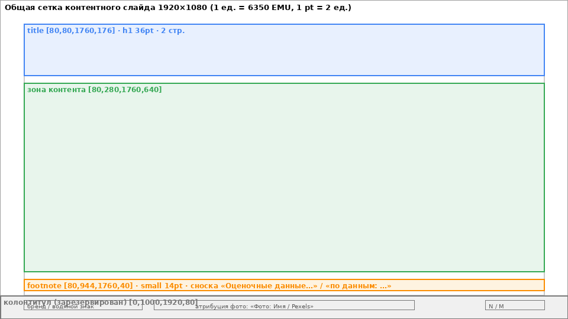

- **Сетка** 1920×1080, 1 единица = 6350 EMU (16:9 в PPTX: 12 192 000 × 6 858 000 EMU). **1 pt = 2 единицы**, высота строки = 1,2 × кегль → строка занимает `pt × 2,4` единиц (спайк, находка 4).
- **Поля** 80 единиц со всех сторон (safe area `[80, 80, 1760, 920]`). Исключения — только декоративные элементы и фото «в край»: полоса `cover_band`, `highlight_band`, фото `cover_split_image`, `statement_image`. Текст всегда внутри полей.
- **Заголовок контентного слайда** `[80, 80, 1760, 176]`, h1 36 pt, до 2 строк; шаг вниз — h2 26 pt.
- **Зона контента** `[80, 280, 1760, 640]` (y 280–920).
- **Сноска** `[80, 944, 1760, 40]`, small 14 pt, 1 строка — «Оценочные данные — проверьте перед показом» или «по данным: <файл>» (ставит код).
- **Колонтитул** `[0, 1000, 1920, 80]` — зарезервирован, макеты его не занимают: слева «Fibonacci.» (только PDF бесплатного тарифа), в центре подпись фото «Фото: Имя / Pexels» (если на слайде фото), справа номер «N / M». Кегль min 12 pt, цвет `text_muted` (на полосе `cover_band` — `on_primary`).
- **Титул и финал** используют свою геометрию (без общего заголовка), сноски на них нет.

---

## 2. Как считается вместимость

Вместимость слота в промпте и в YAML (`max_chars`) — оценка сверху, которую модель должна соблюдать. Точное решение принимает fitter по реальным метрикам шрифта.

```
знаков_в_строке = floor(ширина / (кегль_pt × 2 × k)),  k = 0,55 (обычный), 0,59 (полужирный)
строк           = min(max_lines, floor(высота / (кегль_pt × 2,4)))
вместимость     = floor(знаков_в_строке × строк × 0,9)      # 0,9 — потери на переносе по словам
```

- `max_lines` ограничивает число строк **базового** стиля. На шагах кегля вниз строк столько, сколько помещается по высоте бокса (поэтому на минимальном стиле вместимость больше). У однострочного слота потерь на переносе нет — множитель 0,9 не применяется.

- `k` — средняя ширина знака в долях кегля по замеру Liberation Sans на русском и казахском тексте (0,50–0,55) с запасом: полужирный шире на ~8%.
- Заголовки (h1–h3, display, hero) — полужирные, текст (body, small) — обычный.
- **Числа** (`value`) нельзя сокращать, поэтому их применимость проверяется по вместимости на **минимальном** стиле слота.
- **Тексты, известные до SELECT** (заголовок-утверждение `statement`, тема на титуле), тоже проверяются по минимальному стилю. **Тексты, которые пишет CONTENT**, модель пишет под базовую вместимость варианта.
- Fitter (ТЗ 3.7): мерит текст Liberation Sans (Pillow), переносит по словам, считает высоту; не влезает — шаг кегля вниз до `min_style` → сокращение LLM (1 попытка) → более вместительный вариант того же kind → обрезка по границе предложения с записью в лог.

**Типошкала** (pt): `hero 96` (только `big_number`), `display 60`, `h1 36`, `h2 26`, `h3 20`, `body 18`, `small 14`, `min 12`. Шаги fitter'а: hero → display; display → h1 (титул — до h2); h1 → h2; h2 → h3; h3 → body; body → small. Ниже `small` основной текст не опускается, `min` — только колонтитул.

Таблицы ниже сгенерированы по этой формуле из той же геометрии, что и вайрфреймы. Столбец «Вместимость» — база, в скобках — на минимальном стиле.

---

## 3. Kinds и варианты

### 3.1 `title` — титульный слайд

**Когда:** всегда первый слайд. **Данные:** тема пользователя (заголовок — **дословно**, ставит код, G-05), подзаголовок (план, `deck.subtitle`), автор (ФИО и группа из профиля), фото (если выбран вариант с фото и оно нашлось).

- Тема до 200 знаков (вопрос 8, D-039: сообщение длиннее — текст-материал): база display 60 pt в 3 строки (~59 знаков), шаги до h2 26 pt — на h2 помещается ~280 знаков, поэтому тема всегда встаёт дословно, без обрезки (`never_truncate` в YAML). Пометка в сводке не нужна.
- Подзаголовок — единственное место, где допустима переформулировка темы.
- Автора нет — слот не рисуется, остальная геометрия не сдвигается.

#### `title.cover_center` — Тема по центру, акцентная линия, автор снизу

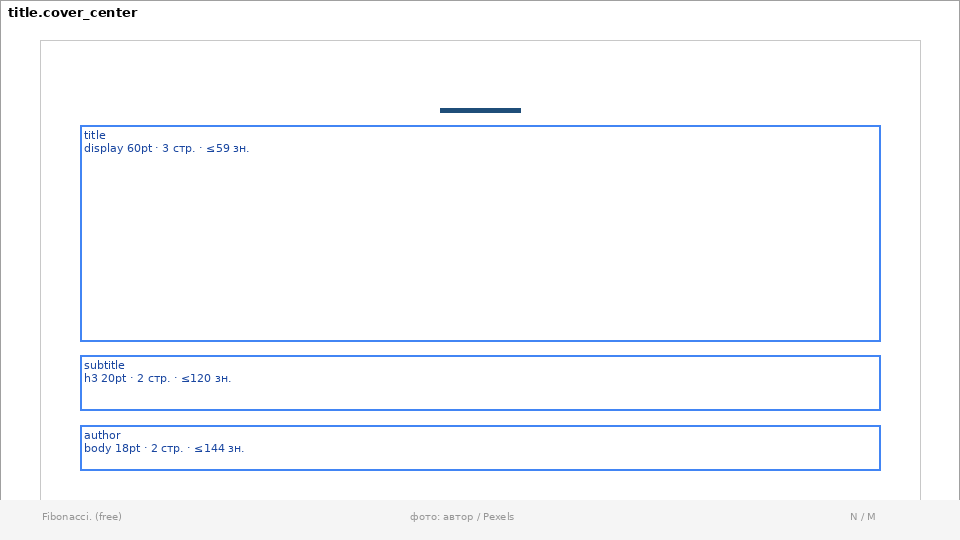

Применимость: всегда (запасной вариант kind).

Фигуры: `accent_line` [880, 216, 160, 8] цвет `primary`.

| Слот | Бокс [x, y, w, h] | Стиль (база → минимум) | Строк | Знаков в строке | Вместимость, знаков |
|---|---|---|---|---|---|
| `title` | [160, 250, 1600, 432] | display 60 → h2 26 | 3 | 22 | **59** (на h2: 280) |
| `subtitle` | [160, 710, 1600, 110] | h3 20 → body 18 | 2 | 67 | **120** (на body: 144) |
| `author` | [160, 850, 1600, 90] | body 18 → small 14 | 2 | 80 | **144** (на small: 185) |


#### `title.cover_band` — Тема слева сверху, цветная полоса снизу с автором

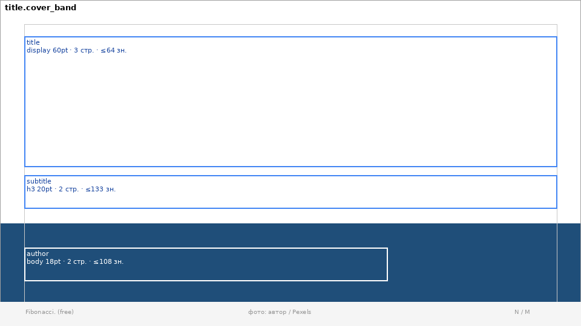

Применимость: всегда.

Фигуры: `band` [0, 740, 1920, 340] цвет `primary`.

| Слот | Бокс [x, y, w, h] | Стиль (база → минимум) | Строк | Знаков в строке | Вместимость, знаков |
|---|---|---|---|---|---|
| `title` | [80, 120, 1760, 432] | display 60 → h2 26 | 3 | 24 | **64** (на h2: 307) |
| `subtitle` | [80, 580, 1760, 110] | h3 20 → body 18 | 2 | 74 | **133** (на body: 158) |
| `author` | [80, 820, 1200, 110] | body 18 → small 14 | 2 | 60 | **108** (на small: 207) |


#### `title.cover_split_image` — Тема слева, фото справа на половину слайда

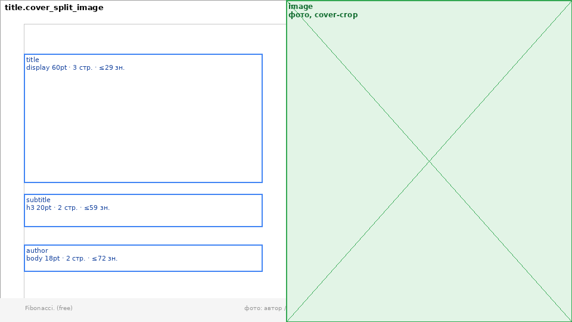

Применимость: есть картинка; тема ≤ 120 знаков.

| Слот | Бокс [x, y, w, h] | Стиль (база → минимум) | Строк | Знаков в строке | Вместимость, знаков |
|---|---|---|---|---|---|
| `title` | [80, 180, 800, 432] | display 60 → h2 26 | 3 | 11 | **29** (на h2: 140) |
| `subtitle` | [80, 650, 800, 110] | h3 20 → body 18 | 2 | 33 | **59** (на body: 72) |
| `author` | [80, 820, 800, 90] | body 18 → small 14 | 2 | 40 | **72** (на small: 91) |
| `image` | [960, 0, 960, 1080] | img | — | — | — |


### 3.2 `statement` — одна главная мысль

**Когда:** одна сильная мысль, вывод-тезис, запрос к аудитории (`role = ask`), проблема питч-дека. **Данные:** утверждение (это `title` слайда, ≤ 20 слов), пояснение (необязательно), фото (для `statement_image`).

- Отдельного заголовка у statement нет: утверждение и есть заголовок-вывод, набранный крупнее.
- `role = ask` (G-04): бонус варианту `highlight_band`; запрос — последний содержательный слайд, перед `closing`.

#### `statement.big_quote` — Крупная кавычка, утверждение, пояснение

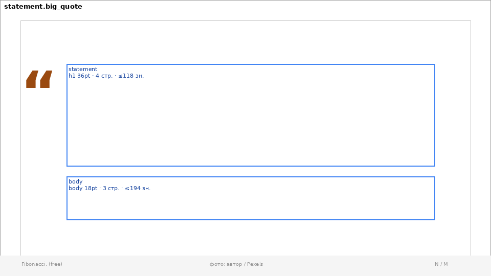

Применимость: утверждение ≤ 150 знаков.

Фигуры: `quote_mark` [80, 250, 120, 120] цвет `accent`.

| Слот | Бокс [x, y, w, h] | Стиль (база → минимум) | Строк | Знаков в строке | Вместимость, знаков |
|---|---|---|---|---|---|
| `statement` | [260, 250, 1440, 400] | h1 36 → h2 26 | 4 | 33 | **118** (на h2: 248) |
| `body` | [260, 690, 1440, 170] | body 18 → small 14 | 3 | 72 | **194** (на small: 418) |


#### `statement.highlight_band` — Утверждение на цветной полосе во всю ширину

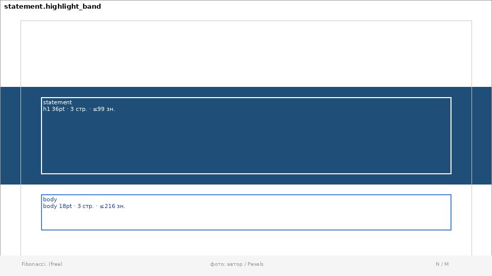

Применимость: утверждение ≤ 120 знаков; предпочтителен для role=ask.

Фигуры: `band` [0, 340, 1920, 380] цвет `primary`.

| Слот | Бокс [x, y, w, h] | Стиль (база → минимум) | Строк | Знаков в строке | Вместимость, знаков |
|---|---|---|---|---|---|
| `statement` | [160, 380, 1600, 300] | h1 36 → h2 26 | 3 | 37 | **99** (на h2: 187) |
| `body` | [160, 760, 1600, 140] | body 18 → small 14 | 3 | 80 | **216** (на small: 370) |


#### `statement.statement_image` — Фото слева, утверждение и пояснение справа

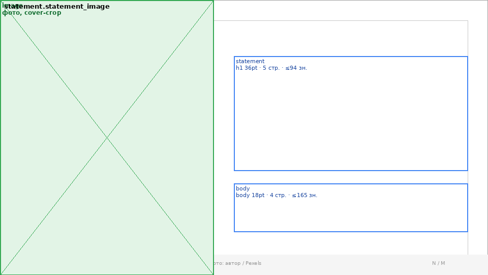

Применимость: есть картинка; утверждение ≤ 110 знаков.

| Слот | Бокс [x, y, w, h] | Стиль (база → минимум) | Строк | Знаков в строке | Вместимость, знаков |
|---|---|---|---|---|---|
| `image` | [0, 0, 840, 1080] | img | — | — | — |
| `statement` | [920, 220, 920, 450] | h1 36 → h2 26 | 5 | 21 | **94** (на h2: 182) |
| `body` | [920, 720, 920, 190] | body 18 → small 14 | 4 | 46 | **165** (на small: 265) |


### 3.3 `bullets` — равноправные пункты

**Когда:** 3–6 равноправных пунктов без порядка и без сравнения. **Данные:** пункты — заголовок (≤ 6 слов) + текст (одно предложение с фактом) + иконка из списка фазы 1.

- Порядок важен → `process`; две стороны → `comparison`; одно число на пункт и пунктов ≤ 4 → `metrics`.
- 2 пункта → `comparison.two_columns` (нейтральная полярность) или `statement` с пояснением; 7+ → два слайда, план делит ряд (ряд не обрезается, ТЗ 4.8.3).

#### `bullets.icon_list` — Список: иконка в круге, заголовок пункта, текст

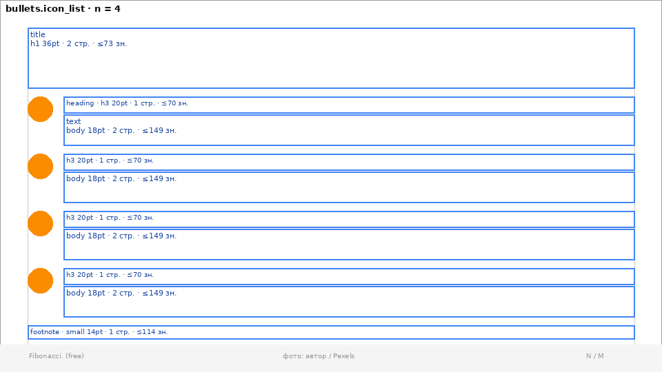

Применимость: 3–4 пункта.

| Слот | Бокс [x, y, w, h] | Стиль (база → минимум) | Строк | Знаков в строке | Вместимость, знаков |
|---|---|---|---|---|---|
| `title` | [80, 80, 1760, 176] | h1 36 → h2 26 | 2 | 41 | **73** (на h2: 102) |
| `footnote` | [80, 944, 1760, 40] | small 14 → min 12 | 1 | 114 | **114** (на min: 133) |
| *n = 3, элемент 1 из 3* | | | | | |
| `icon` | [80, 280, 72, 72] | icon | — | — | — |
| `heading` | [184, 280, 1656, 48] | h3 20 → body 18 | 1 | 70 | **70** (на body: 83) |
| `text` | [184, 332, 1656, 145] | body 18 → small 14 | 3 | 83 | **224** (на small: 385) |
| *n = 4, элемент 1 из 4* | | | | | |
| `icon` | [80, 280, 72, 72] | icon | — | — | — |
| `heading` | [184, 280, 1656, 48] | h3 20 → body 18 | 1 | 70 | **70** (на body: 83) |
| `text` | [184, 332, 1656, 90] | body 18 → small 14 | 2 | 83 | **149** (на small: 192) |


#### `bullets.cards_grid` — Карточки: 3 в ряд, 2×2 или 3×2

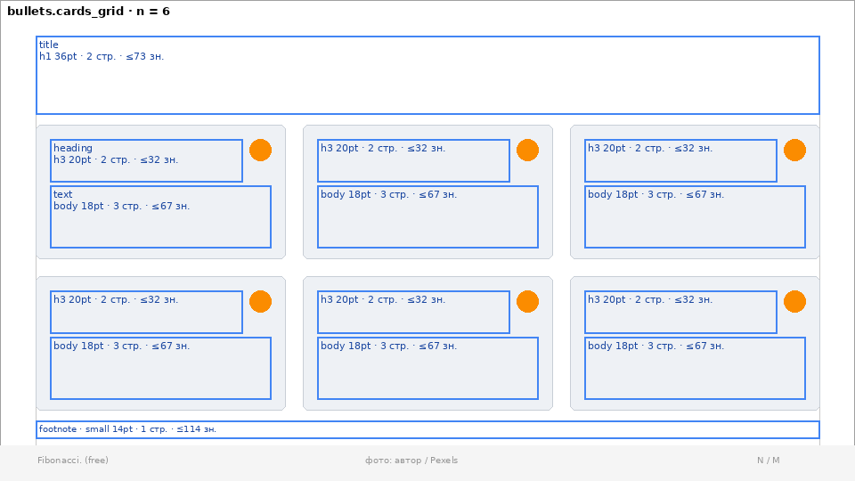 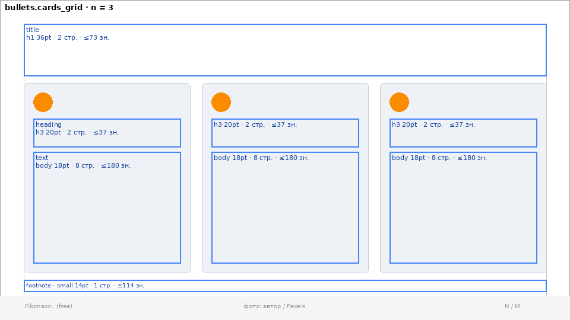 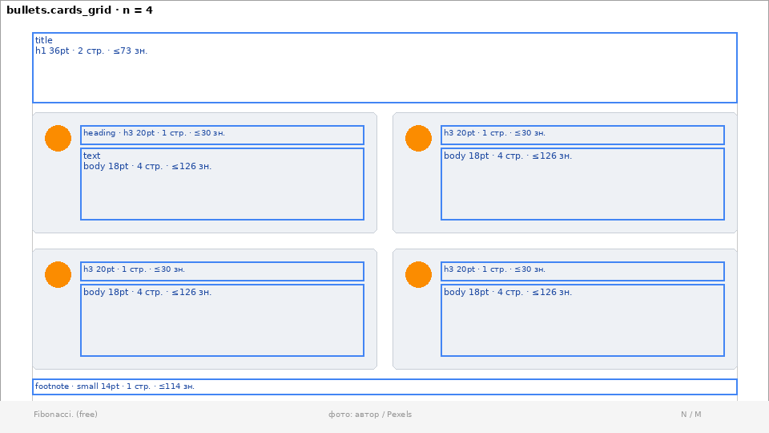

Применимость: 3–6 пунктов.

| Слот | Бокс [x, y, w, h] | Стиль (база → минимум) | Строк | Знаков в строке | Вместимость, знаков |
|---|---|---|---|---|---|
| `title` | [80, 80, 1760, 176] | h1 36 → h2 26 | 2 | 41 | **73** (на h2: 102) |
| `footnote` | [80, 944, 1760, 40] | small 14 → min 12 | 1 | 114 | **114** (на min: 133) |
| *n = 3, элемент 1 из 3* | | | | | |
| `card` | [80, 280, 560, 640] | card | — | — | — |
| `icon` | [112, 312, 64, 64] | icon | — | — | — |
| `heading` | [112, 400, 496, 96] | h3 20 → body 18 | 2 | 21 | **37** (на body: 45) |
| `text` | [112, 512, 496, 376] | body 18 → small 14 | 8 | 25 | **180** (на small: 316) |
| *n = 4, элемент 1 из 4* | | | | | |
| `card` | [80, 280, 860, 300] | card | — | — | — |
| `icon` | [112, 312, 64, 64] | icon | — | — | — |
| `heading` | [200, 312, 708, 48] | h3 20 → body 18 | 1 | 30 | **30** (на body: 35) |
| `text` | [200, 368, 708, 180] | body 18 → small 14 | 4 | 35 | **126** (на small: 202) |
| *n = 5, элемент 1 из 5* | | | | | |
| `card` | [80, 280, 560, 300] | card | — | — | — |
| `icon` | [560, 312, 48, 48] | icon | — | — | — |
| `heading` | [112, 312, 432, 96] | h3 20 → body 18 | 2 | 18 | **32** (на body: 37) |
| `text` | [112, 416, 496, 140] | body 18 → small 14 | 3 | 25 | **67** (на small: 115) |
| *n = 6, элемент 1 из 6* | | | | | |
| `card` | [80, 280, 560, 300] | card | — | — | — |
| `icon` | [560, 312, 48, 48] | icon | — | — | — |
| `heading` | [112, 312, 432, 96] | h3 20 → body 18 | 2 | 18 | **32** (на body: 37) |
| `text` | [112, 416, 496, 140] | body 18 → small 14 | 3 | 25 | **67** (на small: 115) |


#### `bullets.numbered_columns` — Колонки с крупными номерами 01–04

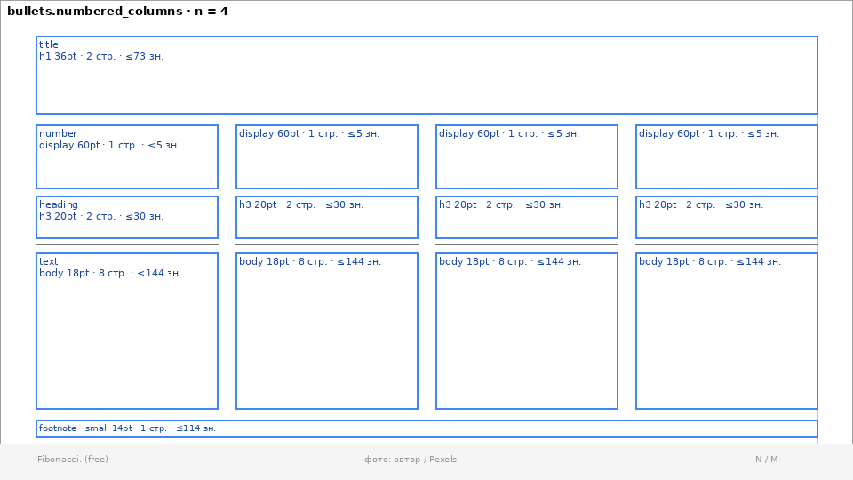

Применимость: 3–4 пункта.

| Слот | Бокс [x, y, w, h] | Стиль (база → минимум) | Строк | Знаков в строке | Вместимость, знаков |
|---|---|---|---|---|---|
| `title` | [80, 80, 1760, 176] | h1 36 → h2 26 | 2 | 41 | **73** (на h2: 102) |
| `footnote` | [80, 944, 1760, 40] | small 14 → min 12 | 1 | 114 | **114** (на min: 133) |
| *n = 3, элемент 1 из 3* | | | | | |
| `number` | [80, 280, 560, 144] | display 60 → h1 36 | 1 | 7 | **7** (на h1: 13) |
| `heading` | [80, 440, 560, 96] | h3 20 → body 18 | 2 | 23 | **41** (на body: 50) |
| `rule` | [80, 548, 560, 4] | line | — | — | — |
| `text` | [80, 568, 560, 352] | body 18 → small 14 | 8 | 28 | **201** (на small: 324) |
| *n = 4, элемент 1 из 4* | | | | | |
| `number` | [80, 280, 410, 144] | display 60 → h1 36 | 1 | 5 | **5** (на h1: 9) |
| `heading` | [80, 440, 410, 96] | h3 20 → body 18 | 2 | 17 | **30** (на body: 36) |
| `rule` | [80, 548, 410, 4] | line | — | — | — |
| `text` | [80, 568, 410, 352] | body 18 → small 14 | 8 | 20 | **144** (на small: 234) |


### 3.4 `comparison` — две стороны

**Когда:** два объекта по одним критериям, «за / против», «до / после», «требование / ограничение». **Данные:** заголовки сторон, 2–4 пункта у каждой, полярность (`neutral`, `pros_cons`, `before_after`).

- Три объекта в фазе 1 — `bullets.cards_grid` (сравнительная таблица — фаза 2).
- `pros_cons` рисует иконки ✓ / ✕ и цвета `positive` / `negative`; для `neutral` он неприменим.

#### `comparison.two_columns` — Две панели с заголовками и пунктами

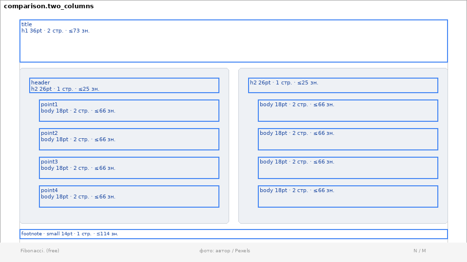

Применимость: 2 объекта, 2–4 пункта у каждого.

| Слот | Бокс [x, y, w, h] | Стиль (база → минимум) | Строк | Знаков в строке | Вместимость, знаков |
|---|---|---|---|---|---|
| `title` | [80, 80, 1760, 176] | h1 36 → h2 26 | 2 | 41 | **73** (на h2: 102) |
| `footnote` | [80, 944, 1760, 40] | small 14 → min 12 | 1 | 114 | **114** (на min: 133) |
| *панель ×2* (левая [80,280,860,640], правая [980,280,860,640]) | | | | | |
| `panel` | [80, 280, 860, 640] | card | — | — | — |
| `header` | [120, 320, 780, 63] | h2 26 → h3 20 | 1 | 25 | **25** (на h3: 33) |
| `point1` | [160, 410, 740, 90] | body 18 → small 14 | 2 | 37 | **66** (на small: 86) |
| `point2` | [160, 528, 740, 90] | body 18 → small 14 | 2 | 37 | **66** (на small: 86) |
| `point3` | [160, 646, 740, 90] | body 18 → small 14 | 2 | 37 | **66** (на small: 86) |
| `point4` | [160, 764, 740, 90] | body 18 → small 14 | 2 | 37 | **66** (на small: 86) |


#### `comparison.pros_cons` — «За / против»: панели с иконками ✓ и ✕

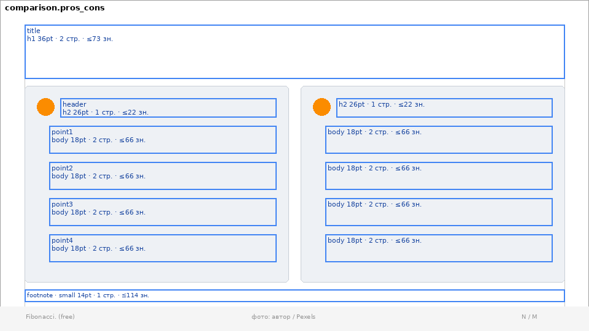

Применимость: 2 стороны с полярностью (плюсы/минусы, было/стало).

| Слот | Бокс [x, y, w, h] | Стиль (база → минимум) | Строк | Знаков в строке | Вместимость, знаков |
|---|---|---|---|---|---|
| `title` | [80, 80, 1760, 176] | h1 36 → h2 26 | 2 | 41 | **73** (на h2: 102) |
| `footnote` | [80, 944, 1760, 40] | small 14 → min 12 | 1 | 114 | **114** (на min: 133) |
| *панель ×2* (левая [80,280,860,640], правая [980,280,860,640]) | | | | | |
| `panel` | [80, 280, 860, 640] | card | — | — | — |
| `icon` | [120, 320, 56, 56] | icon | — | — | — |
| `header` | [196, 320, 704, 63] | h2 26 → h3 20 | 1 | 22 | **22** (на h3: 29) |
| `point1` | [160, 410, 740, 90] | body 18 → small 14 | 2 | 37 | **66** (на small: 86) |
| `point2` | [160, 528, 740, 90] | body 18 → small 14 | 2 | 37 | **66** (на small: 86) |
| `point3` | [160, 646, 740, 90] | body 18 → small 14 | 2 | 37 | **66** (на small: 86) |
| `point4` | [160, 764, 740, 90] | body 18 → small 14 | 2 | 37 | **66** (на small: 86) |


### 3.5 `process` — шаги без дат

**Когда:** 3–6 упорядоченных шагов, механизм, этапы **без дат** (ТЗ 3.3.2). Этапы с датами из источника — в фазе 1 тоже `process`: дата пишется в название шага дословно (`timeline` — фаза 2). **Данные:** шаги — название + пояснение, флаг `cyclic` (цикл — фаза 2, в фазе 1 рисуется как обычный процесс).

#### `process.horizontal_steps` — Кружки с номерами на линии, подписи под ними

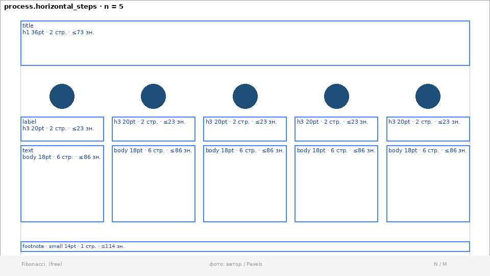

Применимость: 3–5 шагов.

| Слот | Бокс [x, y, w, h] | Стиль (база → минимум) | Строк | Знаков в строке | Вместимость, знаков |
|---|---|---|---|---|---|
| `title` | [80, 80, 1760, 176] | h1 36 → h2 26 | 2 | 41 | **73** (на h2: 102) |
| `footnote` | [80, 944, 1760, 40] | small 14 → min 12 | 1 | 114 | **114** (на min: 133) |
| *n = 3, элемент 1 из 3* | | | | | |
| `circle` | [314, 328, 96, 96] | badge | — | — | — |
| `label` | [80, 456, 565, 96] | h3 20 → body 18 | 2 | 23 | **41** (на body: 50) |
| `text` | [80, 568, 565, 300] | body 18 → small 14 | 6 | 28 | **151** (на small: 259) |
| *n = 4, элемент 1 из 4* | | | | | |
| `circle` | [240, 328, 96, 96] | badge | — | — | — |
| `label` | [80, 456, 416, 96] | h3 20 → body 18 | 2 | 17 | **30** (на body: 37) |
| `text` | [80, 568, 416, 300] | body 18 → small 14 | 6 | 21 | **113** (на small: 194) |
| *n = 5, элемент 1 из 5* | | | | | |
| `circle` | [195, 328, 96, 96] | badge | — | — | — |
| `label` | [80, 456, 326, 96] | h3 20 → body 18 | 2 | 13 | **23** (на body: 28) |
| `text` | [80, 568, 326, 300] | body 18 → small 14 | 6 | 16 | **86** (на small: 151) |


#### `process.chevrons` — Шевроны в ряд, описание под каждым

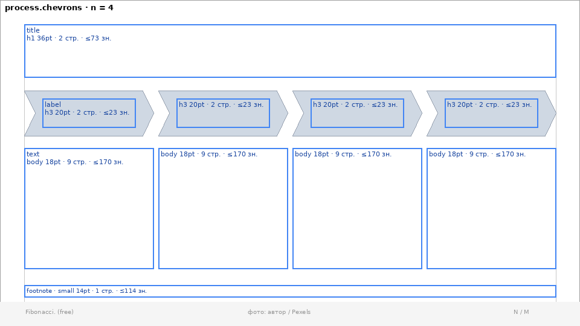

Применимость: 3–4 шага; название шага ≤ 22 знаков.

| Слот | Бокс [x, y, w, h] | Стиль (база → минимум) | Строк | Знаков в строке | Вместимость, знаков |
|---|---|---|---|---|---|
| `title` | [80, 80, 1760, 176] | h1 36 → h2 26 | 2 | 41 | **73** (на h2: 102) |
| `footnote` | [80, 944, 1760, 40] | small 14 → min 12 | 1 | 114 | **114** (на min: 133) |
| *n = 3, элемент 1 из 3* | | | | | |
| `chevron` | [80, 300, 576, 150] | chevron | — | — | — |
| `label` | [140, 327, 456, 96] | h3 20 → body 18 | 2 | 19 | **34** (на body: 41) |
| `text` | [80, 490, 576, 400] | body 18 → small 14 | 9 | 29 | **234** (на small: 366) |
| *n = 4, элемент 1 из 4* | | | | | |
| `chevron` | [80, 300, 428, 150] | chevron | — | — | — |
| `label` | [140, 327, 308, 96] | h3 20 → body 18 | 2 | 13 | **23** (на body: 27) |
| `text` | [80, 490, 428, 400] | body 18 → small 14 | 9 | 21 | **170** (на small: 267) |


#### `process.vertical_steps` — Шаги сверху вниз: номер, название, текст

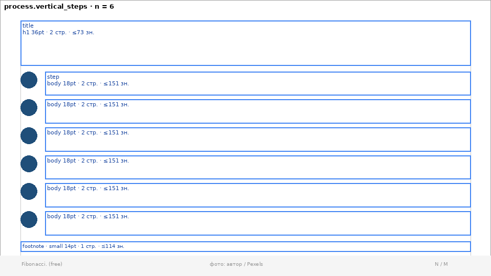

Применимость: 3–6 шагов (запасной вариант kind).

| Слот | Бокс [x, y, w, h] | Стиль (база → минимум) | Строк | Знаков в строке | Вместимость, знаков |
|---|---|---|---|---|---|
| `title` | [80, 80, 1760, 176] | h1 36 → h2 26 | 2 | 41 | **73** (на h2: 102) |
| `footnote` | [80, 944, 1760, 40] | small 14 → min 12 | 1 | 114 | **114** (на min: 133) |
| *n = 3, элемент 1 из 3* | | | | | |
| `badge` | [80, 280, 64, 64] | badge | — | — | — |
| `step` | [176, 280, 1664, 203] | body 18 → small 14 | 4 | 84 | **302** (на small: 583) |
| *n = 4, элемент 1 из 4* | | | | | |
| `badge` | [80, 280, 64, 64] | badge | — | — | — |
| `step` | [176, 280, 1664, 148] | body 18 → small 14 | 3 | 84 | **226** (на small: 388) |
| *n = 5, элемент 1 из 5* | | | | | |
| `badge` | [80, 280, 64, 64] | badge | — | — | — |
| `step` | [176, 280, 1664, 115] | body 18 → small 14 | 2 | 84 | **151** (на small: 291) |
| *n = 6, элемент 1 из 6* | | | | | |
| `badge` | [80, 280, 64, 64] | badge | — | — | — |
| `step` | [176, 280, 1664, 93] | body 18 → small 14 | 2 | 84 | **151** (на small: 194) |


### 3.6 `metrics` — ключевые числа

**Когда:** 1–4 ключевых числа, которые не образуют ряд по времени или доли целого. **Данные:** значение (строкой, как на слайде), единица, подпись (к чему относится — строка и колонка источника), статус (`fact`, `plan`, `requirement`, `constraint`, `estimate`), `source_ref`.

- Больше 4 чисел или у каждого элемента два числа → `chart_series` (если есть dataset) или `bullets` по пункту на элемент — ряд не обрезается (D-015).
- Статус не-факт подписывается: «цель», «требование», «не более»; `estimate` → сноска.

#### `metrics.big_number` — Одно крупное число с подписью и пояснением в карточке

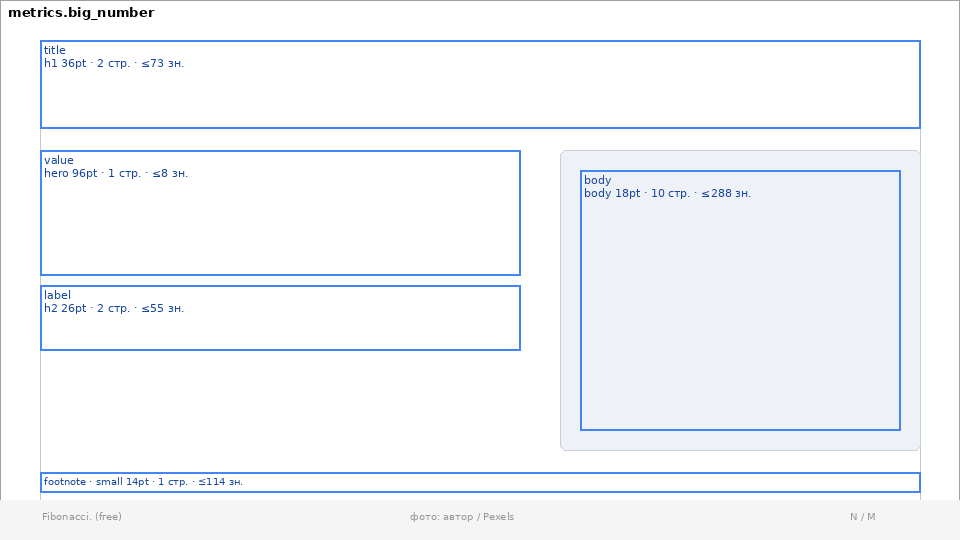

Применимость: ровно 1 число, значение ≤ 13 знаков.

| Слот | Бокс [x, y, w, h] | Стиль (база → минимум) | Строк | Знаков в строке | Вместимость, знаков |
|---|---|---|---|---|---|
| `title` | [80, 80, 1760, 176] | h1 36 → h2 26 | 2 | 41 | **73** (на h2: 102) |
| `value` | [80, 300, 960, 250] | hero 96 → display 60 | 1 | 8 | **8** (на display: 13) |
| `label` | [80, 570, 960, 130] | h2 26 → h3 20 | 2 | 31 | **55** (на h3: 72) |
| `body_card` | [1120, 300, 720, 600] | card | — | — | — |
| `body` | [1160, 340, 640, 520] | body 18 → small 14 | 10 | 32 | **288** (на small: 553) |
| `footnote` | [80, 944, 1760, 40] | small 14 → min 12 | 1 | 114 | **114** (на min: 133) |


#### `metrics.kpi_cards` — 2–4 карточки: значение, единица, подпись

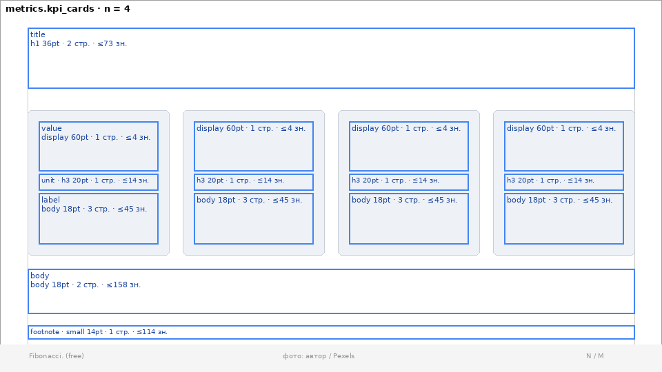 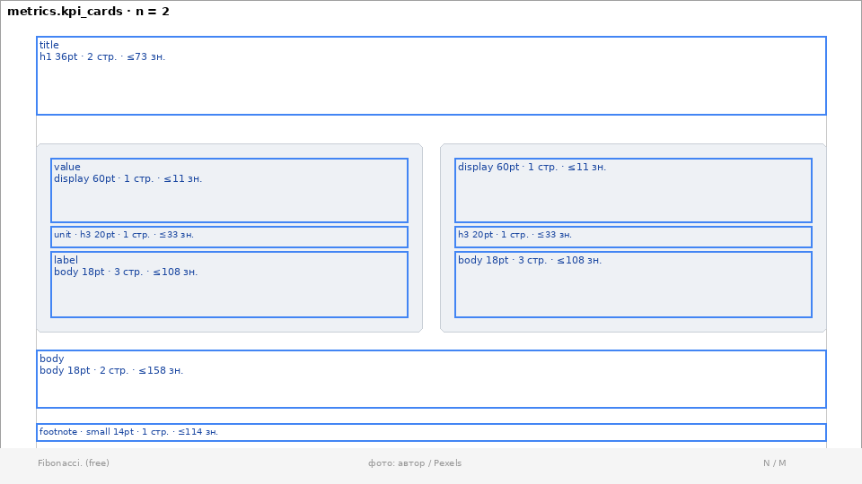

Применимость: 2–4 числа; самое длинное значение ≤ 18 знаков при 2 карточках, ≤ 11 при 3, ≤ 8 при 4.

| Слот | Бокс [x, y, w, h] | Стиль (база → минимум) | Строк | Знаков в строке | Вместимость, знаков |
|---|---|---|---|---|---|
| `title` | [80, 80, 1760, 176] | h1 36 → h2 26 | 2 | 41 | **73** (на h2: 102) |
| `body` | [80, 780, 1760, 130] | body 18 → small 14 | 2 | 88 | **158** (на small: 307) |
| `footnote` | [80, 944, 1760, 40] | small 14 → min 12 | 1 | 114 | **114** (на min: 133) |
| *n = 2, элемент 1 из 2* | | | | | |
| `card` | [80, 320, 860, 420] | card | — | — | — |
| `value` | [112, 352, 796, 144] | display 60 → h1 36 | 1 | 11 | **11** (на h1: 18) |
| `unit` | [112, 504, 796, 48] | h3 20 → body 18 | 1 | 33 | **33** (на body: 40) |
| `label` | [112, 560, 796, 148] | body 18 → small 14 | 3 | 40 | **108** (на small: 183) |
| *n = 3, элемент 1 из 3* | | | | | |
| `card` | [80, 320, 560, 420] | card | — | — | — |
| `value` | [112, 352, 496, 144] | display 60 → h1 36 | 1 | 7 | **7** (на h1: 11) |
| `unit` | [112, 504, 496, 48] | h3 20 → body 18 | 1 | 21 | **21** (на body: 25) |
| `label` | [112, 560, 496, 148] | body 18 → small 14 | 3 | 25 | **67** (на small: 115) |
| *n = 4, элемент 1 из 4* | | | | | |
| `card` | [80, 320, 410, 420] | card | — | — | — |
| `value` | [112, 352, 346, 144] | display 60 → h1 36 | 1 | 4 | **4** (на h1: 8) |
| `unit` | [112, 504, 346, 48] | h3 20 → body 18 | 1 | 14 | **14** (на body: 17) |
| `label` | [112, 560, 346, 148] | body 18 → small 14 | 3 | 17 | **45** (на small: 79) |


### 3.7 `chart_series` — ряд чисел

**Когда:** ряд чисел по времени или категориям из **dataset** источника. «По теме» не применяется (ТЗ 3.3.3). **Данные:** ссылка на dataset (колонка подписей, 1–3 колонки значений, строки), вывод (`insight`), подпись оси значений. Значения и категории ставит код из dataset, модель чисел не пишет (D-028).

- `line_chart` — только если ось — время (`axis = time`: месяцы, кварталы, годы) и точек ≥ 4. Иначе `column_chart`.
- Строка «Итого» в ряд не входит; категории — в порядке источника.
- Нативная диаграмма: подписи значений над столбцами / у точек цветом `text`, ось значений с единицей, легенда снизу при 2+ сериях, без заголовка диаграммы (заголовок — у слайда), цвета серий — `chart_1…3`.

#### `chart_series.column_chart` — Столбчатая диаграмма + карточка с выводом

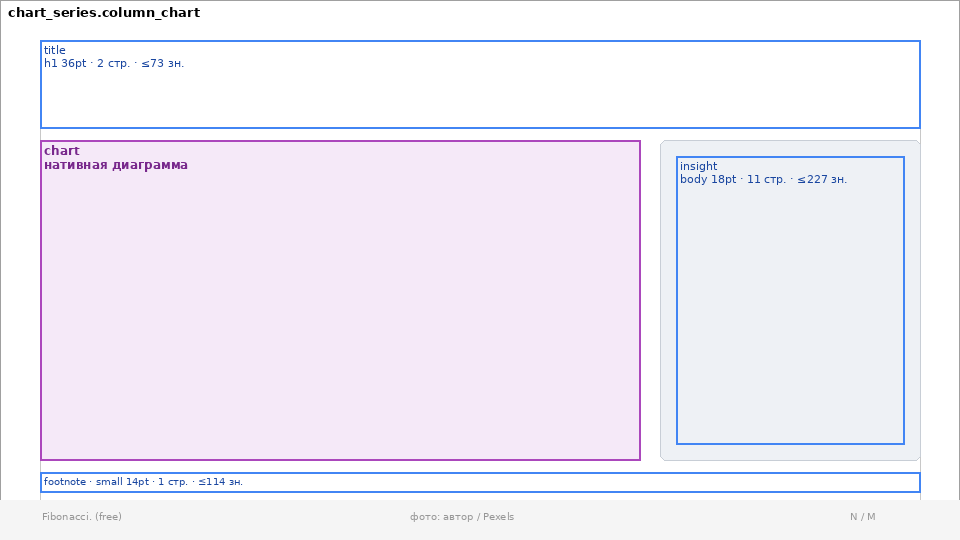

Применимость: до 12 категорий, 1–3 серии.

| Слот | Бокс [x, y, w, h] | Стиль (база → минимум) | Строк | Знаков в строке | Вместимость, знаков |
|---|---|---|---|---|---|
| `title` | [80, 80, 1760, 176] | h1 36 → h2 26 | 2 | 41 | **73** (на h2: 102) |
| `chart` | [80, 280, 1200, 640] | chart | — | — | — |
| `insight_card` | [1320, 280, 520, 640] | card | — | — | — |
| `insight` | [1352, 312, 456, 576] | body 18 → small 14 | 11 | 23 | **227** (на small: 443) |
| `footnote` | [80, 944, 1760, 40] | small 14 → min 12 | 1 | 114 | **114** (на min: 133) |


#### `chart_series.line_chart` — Линейная диаграмма во всю ширину + вывод строкой

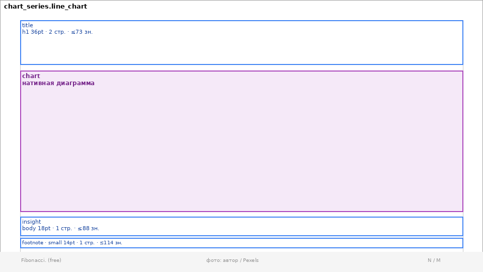

Применимость: ось — время (месяцы, кварталы, годы), 4–24 точки, 1–3 серии.

| Слот | Бокс [x, y, w, h] | Стиль (база → минимум) | Строк | Знаков в строке | Вместимость, знаков |
|---|---|---|---|---|---|
| `title` | [80, 80, 1760, 176] | h1 36 → h2 26 | 2 | 41 | **73** (на h2: 102) |
| `chart` | [80, 280, 1760, 560] | chart | — | — | — |
| `insight` | [80, 860, 1760, 76] | body 18 → small 14 | 1 | 88 | **88** (на small: 205) |
| `footnote` | [80, 944, 1760, 40] | small 14 → min 12 | 1 | 114 | **114** (на min: 133) |


### 3.8 `chart_share` — доли целого

**Когда:** 2–6 долей одного целого, сумма 95–105% (или значения, из которых доля считается кодом). «По теме» не применяется. **Данные:** dataset (колонка подписей, колонка долей или значений), вывод.

- Все доли ряда — на одной диаграмме (G-01, G-04). Больше 6 долей → хвост складывается в «прочее» **только если** так в источнике; иначе `chart_series.column_chart`.
- Кольцо: дырка 60%, без подписей на секторах (значения — в легенде справа, контраст подписей на цветных секторах не гарантирован), без заголовка диаграммы. Цвета — `chart_1…6` по порядку строк источника.

#### `chart_share.donut` — Кольцевая диаграмма + легенда со значениями + вывод

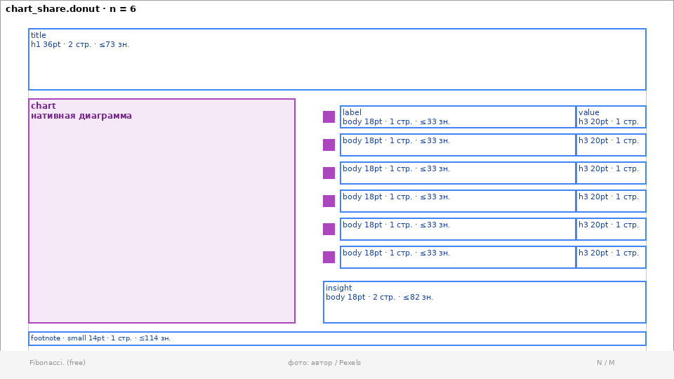

Применимость: 2–6 долей, сумма 95–105%.

| Слот | Бокс [x, y, w, h] | Стиль (база → минимум) | Строк | Знаков в строке | Вместимость, знаков |
|---|---|---|---|---|---|
| `title` | [80, 80, 1760, 176] | h1 36 → h2 26 | 2 | 41 | **73** (на h2: 102) |
| `chart` | [80, 280, 760, 640] | chart | — | — | — |
| `insight` | [920, 800, 920, 120] | body 18 → small 14 | 2 | 46 | **82** (на small: 159) |
| `footnote` | [80, 944, 1760, 40] | small 14 → min 12 | 1 | 114 | **114** (на min: 133) |
| *n = 2, элемент 1 из 2* | | | | | |
| `swatch` | [920, 316, 32, 32] | swatch | — | — | — |
| `label` | [968, 300, 672, 64] | body 18 → small 14 | 1 | 33 | **33** (на small: 43) |
| `value` | [1640, 300, 200, 64] | h3 20 → body 18 | 1 | 8 | **8** (на body: 10) |
| *n = 3, элемент 1 из 3* | | | | | |
| `swatch` | [920, 316, 32, 32] | swatch | — | — | — |
| `label` | [968, 300, 672, 64] | body 18 → small 14 | 1 | 33 | **33** (на small: 43) |
| `value` | [1640, 300, 200, 64] | h3 20 → body 18 | 1 | 8 | **8** (на body: 10) |
| *n = 4, элемент 1 из 4* | | | | | |
| `swatch` | [920, 316, 32, 32] | swatch | — | — | — |
| `label` | [968, 300, 672, 64] | body 18 → small 14 | 1 | 33 | **33** (на small: 43) |
| `value` | [1640, 300, 200, 64] | h3 20 → body 18 | 1 | 8 | **8** (на body: 10) |
| *n = 5, элемент 1 из 5* | | | | | |
| `swatch` | [920, 316, 32, 32] | swatch | — | — | — |
| `label` | [968, 300, 672, 64] | body 18 → small 14 | 1 | 33 | **33** (на small: 43) |
| `value` | [1640, 300, 200, 64] | h3 20 → body 18 | 1 | 8 | **8** (на body: 10) |
| *n = 6, элемент 1 из 6* | | | | | |
| `swatch` | [920, 316, 32, 32] | swatch | — | — | — |
| `label` | [968, 300, 672, 64] | body 18 → small 14 | 1 | 33 | **33** (на small: 43) |
| `value` | [1640, 300, 200, 64] | h3 20 → body 18 | 1 | 8 | **8** (на body: 10) |


### 3.9 `conclusion` — выводы

**Когда:** предпоследний слайд (или перед запросом), 2–5 выводов. **Данные:** выводы — то, что следует из фактов, а не их пересказ; не повторяют заголовки и числа других слайдов (правило текущих промптов, D-024).

#### `conclusion.numbered_takeaways` — Нумерованные выводы строками

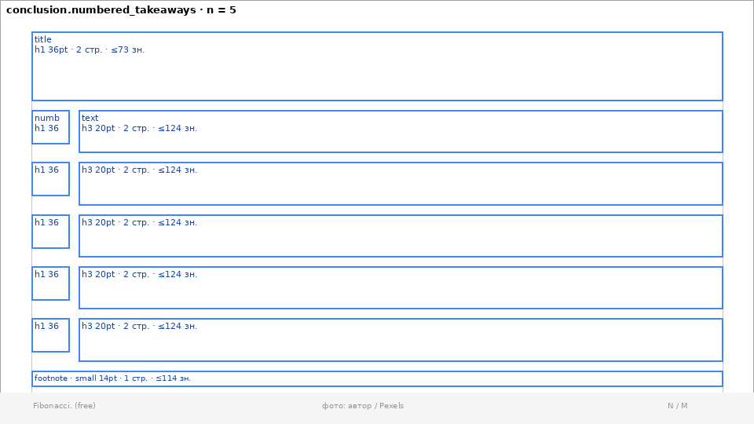

Применимость: 2–5 выводов (запасной вариант kind).

| Слот | Бокс [x, y, w, h] | Стиль (база → минимум) | Строк | Знаков в строке | Вместимость, знаков |
|---|---|---|---|---|---|
| `title` | [80, 80, 1760, 176] | h1 36 → h2 26 | 2 | 41 | **73** (на h2: 102) |
| `footnote` | [80, 944, 1760, 40] | small 14 → min 12 | 1 | 114 | **114** (на min: 133) |
| *n = 2, элемент 1 из 2* | | | | | |
| `number` | [80, 280, 96, 86] | h1 36 → h2 26 | 0 | 2 | **2** (на h2: 3) |
| `text` | [200, 280, 1640, 308] | h3 20 → body 18 | 3 | 69 | **186** (на body: 516) |
| *n = 3, элемент 1 из 3* | | | | | |
| `number` | [80, 280, 96, 86] | h1 36 → h2 26 | 0 | 2 | **2** (на h2: 3) |
| `text` | [200, 280, 1640, 197] | h3 20 → body 18 | 3 | 69 | **186** (на body: 295) |
| *n = 4, элемент 1 из 4* | | | | | |
| `number` | [80, 280, 96, 86] | h1 36 → h2 26 | 0 | 2 | **2** (на h2: 3) |
| `text` | [200, 280, 1640, 142] | h3 20 → body 18 | 2 | 69 | **124** (на body: 221) |
| *n = 5, элемент 1 из 5* | | | | | |
| `number` | [80, 280, 96, 86] | h1 36 → h2 26 | 0 | 2 | **2** (на h2: 3) |
| `text` | [200, 280, 1640, 109] | h3 20 → body 18 | 2 | 69 | **124** (на body: 147) |


#### `conclusion.cards` — Выводы карточками в ряд

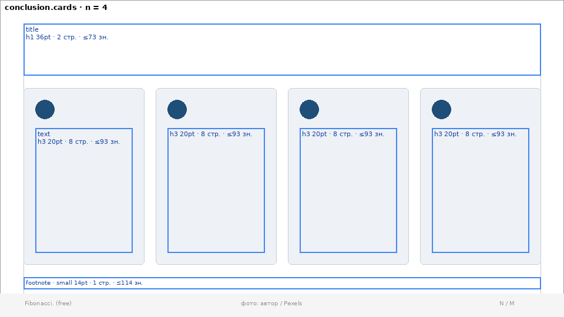

Применимость: 2–4 вывода.

| Слот | Бокс [x, y, w, h] | Стиль (база → минимум) | Строк | Знаков в строке | Вместимость, знаков |
|---|---|---|---|---|---|
| `title` | [80, 80, 1760, 176] | h1 36 → h2 26 | 2 | 41 | **73** (на h2: 102) |
| `footnote` | [80, 944, 1760, 40] | small 14 → min 12 | 1 | 114 | **114** (на min: 133) |
| *n = 2, элемент 1 из 2* | | | | | |
| `card` | [80, 300, 860, 600] | card | — | — | — |
| `badge` | [120, 340, 64, 64] | badge | — | — | — |
| `text` | [120, 436, 780, 424] | h3 20 → body 18 | 8 | 33 | **237** (на body: 315) |
| *n = 3, элемент 1 из 3* | | | | | |
| `card` | [80, 300, 560, 600] | card | — | — | — |
| `badge` | [120, 340, 64, 64] | badge | — | — | — |
| `text` | [120, 436, 480, 424] | h3 20 → body 18 | 8 | 20 | **144** (на body: 194) |
| *n = 4, элемент 1 из 4* | | | | | |
| `card` | [80, 300, 410, 600] | card | — | — | — |
| `badge` | [120, 340, 64, 64] | badge | — | — | — |
| `text` | [120, 436, 330, 424] | h3 20 → body 18 | 8 | 13 | **93** (на body: 129) |


### 3.10 `closing` — финальный слайд

**Когда:** всегда последний. **Данные:** «Спасибо за внимание» на языке колоды (код), контакты или приглашение к вопросам (из брифа питч-дека, иначе пусто), автор. Модель этот слайд не пишет.

#### `closing.thanks_center` — Благодарность по центру, контакты/вопросы, автор

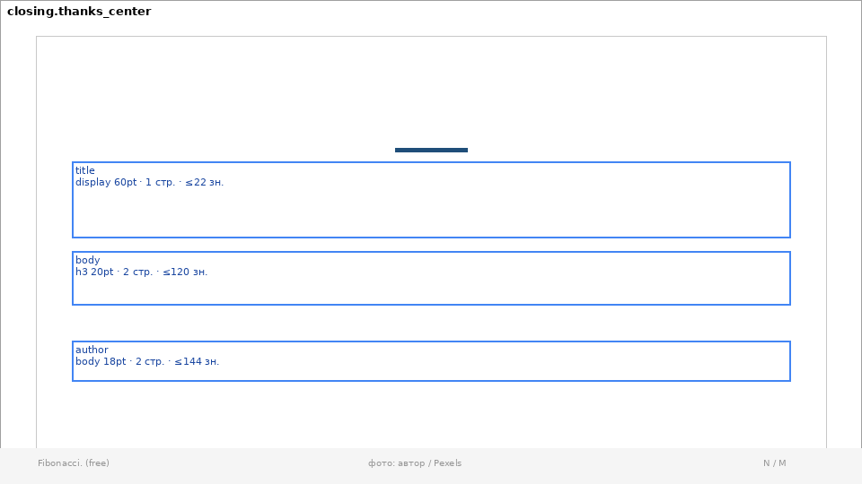

Применимость: всегда.

Фигуры: `accent_line` [880, 330, 160, 8] цвет `primary`.

| Слот | Бокс [x, y, w, h] | Стиль (база → минимум) | Строк | Знаков в строке | Вместимость, знаков |
|---|---|---|---|---|---|
| `title` | [160, 360, 1600, 170] | display 60 → h1 36 | 1 | 22 | **22** (на h1: 37) |
| `body` | [160, 560, 1600, 120] | h3 20 → body 18 | 2 | 67 | **120** (на body: 144) |
| `author` | [160, 760, 1600, 90] | body 18 → small 14 | 2 | 80 | **144** (на small: 185) |


---

## 4. Выбор варианта кодом (ТЗ 3.4.3)

Вариант выбирает `core/selection` после OUTLINE и до CONTENT. Модель вариант не выбирает и о вариантах не знает (D-002).

### 4.1 Входы
Для каждого слайда плана: `kind`, `role`, `items_planned`, длина заголовка (для `statement` и титула), наличие `image_query`, dataset (число категорий, `axis`, сумма долей), `image_mode`. Для колоды: `seed`, тема, уже выбранные варианты соседей.

### 4.2 Алгоритм
1. **Фильтр применимости** по `applies_when` варианта: число элементов, картинка (`required` — только если `image_mode = web`, у слайда есть `image_query` и бюджет картинок не исчерпан: не больше одной на два слайда), ось времени и число точек (line), сумма долей (donut), длина известных текстов и значений — по вместимости на минимальном стиле (раздел 2).
2. **Скоринг** каждого применимого варианта:
   - −3 за каждое использование варианта в колоде;
   - −2, если у соседнего слайда (слева) та же **визуальная семья** (4.3);
   - +2 за совпадение роли: `ask` → `statement.highlight_band`; `results` с одним числом → `metrics.big_number`; `criteria` и `requirements` → `bullets.numbered_columns` / `process.vertical_steps`;
   - +1 за соответствие сюжету (storyline может задать предпочтение, например титул питч-дека — `cover_split_image`);
   - шум `U(0; 0,5)` из генератора с зерном `hash(seed, slide_id)` — колоды с разным `seed` различаются, с одинаковым — воспроизводимы.
3. Берётся вариант с максимальным скором; при равенстве — по порядку в каталоге.
4. **Нет применимых** → запасной вариант kind (`fallback: true`); не применим и он → kind `bullets` (`cards_grid` или `icon_list`).
5. После CONTENT и FIT: если текст не поместился даже на минимальном стиле и после сокращения — FIT повторяет шаг 2 среди вариантов того же kind, где содержание помещается. Содержание от этого не меняется (`04_CONTRACTS.md`, 5).

### 4.3 Визуальные семьи

| Семья | Варианты |
|---|---|
| `cover` | все `title.*` |
| `quote` | `statement.big_quote` |
| `band` | `statement.highlight_band`, `title.cover_band` |
| `image_split` | `statement.statement_image`, `title.cover_split_image` |
| `list` | `bullets.icon_list`, `process.vertical_steps`, `conclusion.numbered_takeaways` |
| `cards` | `bullets.cards_grid`, `metrics.kpi_cards`, `conclusion.cards` |
| `columns` | `bullets.numbered_columns`, `process.horizontal_steps`, `process.chevrons` |
| `panels` | `comparison.two_columns`, `comparison.pros_cons` |
| `hero` | `metrics.big_number` |
| `chart` | `chart_series.*`, `chart_share.donut` |
| `closing` | `closing.thanks_center` |

### 4.4 Метрики разнообразия (проверяются тестом на колодах golden)
- в колоде из 10+ слайдов нет двух подряд одинаковых вариантов;
- не меньше 60% содержательных слайдов имеют уникальный вариант;
- для одного плана с разным `seed` различается не меньше 50% вариантов (там, где у kind больше одного применимого варианта).

С 22 вариантами и 2–3 вариантами у частых kinds (`bullets`, `statement`, `process`) метрики достижимы на колодах из 9 слайдов. Узкое место — kinds с одним вариантом (`chart_share`, `closing`): они не повторяются в колоде по смыслу.

---

## 5. Деградация между kinds

| Ситуация | Что делает код |
|---|---|
| `chart_series` / `chart_share` без dataset или «по теме» | `metrics` (≤ 4 числа из refs) или `bullets` |
| `chart_share`: сумма долей вне 95–105%, долей > 6 | `chart_series.column_chart` по тем же данным |
| `metrics` > 4 чисел | `chart_series` (если есть dataset) или `bullets` по пункту на элемент |
| `bullets` > 6 пунктов | план делит на два слайда; если план уже зафиксирован — `process.vertical_steps` (до 6) |
| `comparison` с 3 объектами | `bullets.cards_grid` |
| `process` > 6 шагов | `vertical_steps` + два слайда |
| Слайд без контента после CONTENT | `bullets` из `key_message` и заголовка (без LLM) |
| Картинка не нашлась | тот же kind, вариант без картинки |

---

## 6. Темы: токены

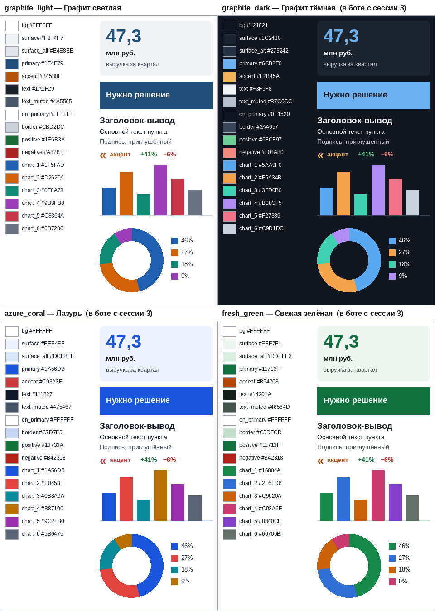

Четыре темы фазы 1 (D-037): две сдержанные графитовые и две яркие. Токены — `themes/<id>.yaml` (уже в репозитории, источник правды), образцы — `wireframes/00_themes.png` (собирается из YAML скриптом `scripts/draw_themes.py`). В боте с сессии 1 — только `graphite_light` (`enabled: true`); выбор четырёх тем в сводке — сессия 3. Все темы бесплатны в фазе 1 (вопрос 12).

| Тема | Характер | В сводке бота |
|---|---|---|
| `graphite_light` | сдержанная светлая: графит и тёмно-синий, янтарный акцент | ☀️ Графит светлая |
| `graphite_dark` | сдержанная тёмная: тёмно-синий фон, голубой и янтарный | 🌙 Графит тёмная |
| `azure_coral` | яркая: насыщенный синий с коралловым акцентом, голубоватые карточки | 🌊 Лазурь |
| `fresh_green` | яркая: свежая зелёная с янтарным акцентом, мятные карточки | 🌿 Свежая зелёная |

### 6.1 Цвета

| Токен | Назначение | `graphite_light` | `graphite_dark` | `azure_coral` | `fresh_green` |
|---|---|---|---|---|---|
| `bg` | фон слайда | `#FFFFFF` | `#121821` | `#FFFFFF` | `#FFFFFF` |
| `surface` | карточки, панели | `#F2F4F7` | `#1C2430` | `#EEF4FF` | `#EEF7F1` |
| `surface_alt` | вторичные подложки | `#E4E8EE` | `#273242` | `#DCE8FE` | `#DDEFE3` |
| `primary` | полосы, кружки, крупные числа, акцент заголовка | `#1F4E79` | `#6CB2F0` | `#1A56DB` | `#11713F` |
| `accent` | кавычка, номера, выделение | `#B4530F` | `#F2B45A` | `#C93A3F` | `#B54708` |
| `text` | основной текст | `#1A1F29` | `#F3F5F8` | `#111827` | `#14201A` |
| `text_muted` | подписи, текст карточек, колонтитул | `#4A5565` | `#B7C0CC` | `#475467` | `#46564D` |
| `on_primary` | текст на `primary` | `#FFFFFF` | `#0E1520` | `#FFFFFF` | `#FFFFFF` |
| `border` | линии, обводки | `#CBD2DC` | `#3A4657` | `#C7D7F5` | `#C5DFCD` |
| `positive` / `negative` | «за / против», рост / падение | `#1E6B3A` / `#A8261F` | `#6FCF97` / `#F08A80` | `#13733A` / `#B42318` | `#11713F` / `#B42318` |
| `chart_1…6` | серии и сектора | `#1F5FAD` `#D2620A` `#0F8A73` `#9B3FB8` `#C8364A` `#6B7280` | `#5AA9F0` `#F5A34B` `#3FD0B0` `#B08CF5` `#F27389` `#C9D1DC` | `#1A56DB` `#E0453F` `#0B8A9A` `#B87100` `#9C2FB0` `#5B6475` | `#16884A` `#2F6FD6` `#C9620A` `#C93A6E` `#8340C8` `#66706B` |

**Цвета диаграмм** (правка владельца 01.10.2026: в прежней палитре `graphite_light` коричневый, оливковый и серо-зелёный рядом смотрелись грязно). Правила для всех тем, проверяются тестом `test_core_models.Themes`:
- чистые насыщенные тона разных оттенков: синий, оранжевый, бирюзовый, фиолетовый, малиновый; шестой — нейтральный серый для «прочее»;
- первые пять попарно различимы: цветовое расстояние CIEDE2000 ≥ 20 (минимум по темам: 25,0 / 23,5 / 22,1 / 21,4);
- каждый цвет — графика с контрастом ≥ 3:1 и к `bg`, и к `surface` (порог WCAG для нетекстовых элементов);
- соседние по порядку цвета контрастны по оттенку: в кольце из 2–4 долей рядом не оказываются близкие тона.

### 6.2 Контраст пар, которые встречаются в макетах (≥ 4.5:1)

| Текст / фон | graphite_light | graphite_dark | azure_coral | fresh_green |
|---|---|---|---|---|
| `text` на `bg` | 16.51 | 16.32 | 17.74 | 16.78 |
| `text` на `surface` | 14.98 | 14.30 | 16.07 | 15.35 |
| `text` на `surface_alt` | 13.43 | 11.86 | 14.38 | 14.01 |
| `text_muted` на `bg` | 7.56 | 9.70 | 7.69 | 7.78 |
| `text_muted` на `surface` | 6.86 | 8.50 | 6.96 | 7.12 |
| `primary` на `bg` | 8.66 | 7.86 | 6.18 | 6.07 |
| `primary` на `surface` | 7.86 | 6.89 | 5.60 | 5.56 |
| `accent` на `bg` | 5.02 | 9.72 | 5.05 | 5.43 |
| `accent` на `surface` | 4.55 | 8.52 | 4.57 | 4.96 |
| `positive` на `surface` | 5.92 | 8.22 | 5.37 | 5.56 |
| `negative` на `surface` | 6.43 | 6.44 | 5.95 | 6.01 |
| `on_primary` на `primary` | 8.66 | 8.08 | 6.18 | 6.07 |
| `chart_1…6` к `bg` (графика, ≥ 3:1), минимум | 3.82 | 6.44 | 3.89 | 4.01 |
| `chart_1…6` к `surface` (графика, ≥ 3:1), минимум | 3.47 | 5.64 | 3.52 | 3.67 |

Правила: `accent` как цвет текста — только на `bg` и `surface`; подписи значений диаграмм — цветом `text`. Тест тем проверяет все пары из `contrast_pairs` каждой темы (`04_CONTRACTS.md`, 6.2). Акцент `graphite_light` стал темнее (`#9A4A10` → `#B4530F` — чище оранжевый при контрасте ≥ 4.5 на `surface`).

### 6.3 Шрифт и стиль
- **Шрифт** — Arial для заголовков и текста (D-027); метрики fitter'а — Liberation Sans.
- **Начертания:** hero, display, h1–h3 — полужирные; body, small, min — обычные. Курсив не используется.
- **Выравнивание:** заголовки и текст — по левому краю; титул `cover_center`, финал и `big_number.value` — по центру / по левому краю по вайрфрейму; числа в легенде — по правому краю.
- **Карточки:** заливка `surface`, без обводки, радиус 8 (все темы). Тени не используются (спайк, находка 1).
- **Декор:** акцентная линия 160×8 `primary` на титуле и финале; полосы `primary` в `cover_band`, `highlight_band`.
- **Фото:** без рамки, cover-crop под бокс слота.
- **Иконки:** PNG 512 px из Tabler Icons (MIT), цвет «запекается» при генерации по токену (`primary` на `bg`, `on_primary` в кружке `primary`). Набор фазы 1 — список иконок текущего каталога доклада (25 шт.).

---

## 7. Правила рендера (из спайка PPTX)

1. У каждой фигуры удаляется `<p:style>`, цвета заливки и линии задаются явно — иначе тень темы в LibreOffice и разный вид в приложениях.
2. Автоподбор размера выключен (`MSO_AUTO_SIZE.NONE`), внутренние поля текстовых рамок — 0. Размер текста задаёт fitter.
3. Каждому фрагменту текста — атрибут `lang` по языку колоды (`ru-RU`, `kk-KZ`, …).
4. Кольцевая диаграмма: `has_title = False`, размер дырки 60% через XML; подписи на секторах выключены (значения в легенде слайда).
5. Столбчатая и линейная: подписи значений включены (`show_value = True`), формат числа — как в источнике (запятая как разделитель для ru, kk, uz), ось значений с единицей из dataset, линии сетки — `border`.
6. Нативные таблицы (фаза 2): в `a:tcPr` элементы границ `a:lnL/R/T/B` идут до заливки ячейки.
7. Метаданные: `dc:title` — тема, `dc:creator` — пользователь, `Application` и `lastModifiedBy` — «Fibonacci AI».
8. Заметки последнего слайда — список источников фото (автор, Pexels, ссылка).
