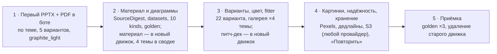

# 09. План реализации фазы 1

**Статус:** утверждено 01.10.2026; сессия 1 — PR #78 (смёржен), сессия 2 — PR #79 · **Дата:** 30.09.2026, правка 01.10.2026 · **Опирается на:** `01…08`, `10_OPEN_QUESTIONS.md`, `CLAUDE.md` (один PR на сессию)

Пять сессий. Каждая — одна ветка от свежего `main`, один PR, и заканчивается **рабочим проверяемым состоянием**: бот генерирует, тесты зелёные, владелец может руками проверить результат. Следующая сессия начинается после мёржа предыдущей.

---

## Сессия 1. Первый PPTX + PDF в боте

**Состав:**
- Каркас `src/core/` по `03_ARCHITECTURE.md`, 2: `models` (DeckRequest, SourceDigest в режиме «по теме», DeckSpec, LayoutSpec, Theme), `llm` (structured outputs — первым делом проверка на gpt-6-luna через proxyapi, вопрос 6), `planning` (OUTLINE, сюжет доклада по теме), `selection` (пока по одному варианту на kind), `content`, `fitting` v0 (метрики Liberation Sans, шаги кегля, обрезка по предложению), `render/pptx`, `render/pdf`, `pipeline`.
- kinds и варианты: `title.cover_center`, `statement.big_quote`, `bullets.cards_grid`, `conclusion.numbered_takeaways`, `closing.thanks_center`; тема `graphite_light`.
- Код ставит тему пользователя на титул дословно (G-05), сноску «Оценочные данные…» у слайдов с числами.
- Миграция `0005_decks`; бот: «Сгенерировать» создаёт `decks` и ставит `generate_deck_job`; прогресс по этапам; выдача PPTX + PDF одним альбомом.
- **Временная маршрутизация** (D-038, `08_MIGRATION.md`, 2.1): доклад по теме — новый движок; материал (текст или файл) и питч-дек — старый, до сессий 2 и 3.
- Порог «тема / текст» — 200 знаков (вопрос 8, D-039). Токены всех четырёх тем — `themes/*.yaml` (в боте включена `graphite_light`, D-037).
- Dockerfile: + LibreOffice и шрифты (Playwright пока остаётся); `fonts/`, `assets/icons/`.
- `prompts/v2/`: `outline/system.txt`, `rules_topic.txt`, `storylines/doklad_topic.yaml`, `content/system.txt`, kinds `statement`, `bullets`, `conclusion`.
- Юнит-тесты: модели, OUTLINE-проверки, selection, fitter, рендер (обратное чтение PPTX), конвертация.

**Зависит от:** утверждения `docs/design/` (утверждено 01.10.2026); ответов на вопросы 2, 6, 8, 11 — получены (`10_OPEN_QUESTIONS.md`). Вопрос 6 проверяется пробным вызовом в workflow «golden» этого PR; клиент работает в обоих вариантах.

**Готово, когда:**
- в боте доклад по теме → PPTX и PDF, 5–9 слайдов, титул = тема дословно;
- PPTX читается python-pptx, PDF собирается LibreOffice, у фигур нет теней, шрифт Arial;
- `decks`: строка `done` со `spec`, длительностями и стоимостью; логи с `deck_id`;
- юнит-тесты и CI зелёные; G-05 проходит проверку титула (прогон вручную).

**Владелец проверяет руками:**
1. `/new` → «Доклад» → тема «Как работает фотосинтез» → «Нет, по теме» → «Сгенерировать»: статус меняется по этапам, приходят два файла.
2. PPTX открыть в PowerPoint, Keynote и Google Slides: без предложения восстановить, текст редактируется, шрифт Arial, заголовок титула = тема. Совмещается с чек-листом спайка (`docs/SPIKE_PPTX.md`, 5; вопрос 11) — чек-лист в описании PR.
3. PDF выглядит так же, как PPTX.
4. Доклад с текстом-материалом и питч-дек по-прежнему приходят одним PDF старого движка (временная маршрутизация).
5. Railway: сначала выкатить воркер, потом бота (`08_MIGRATION.md`, 5).

---

## Сессия 2. Материал и диаграммы

**Состав:**
- Временная маршрутизация материала удаляется: доклад по тексту и файлу — новый движок (`08_MIGRATION.md`, 2.1).
- `core/ingest`: docx, pdf, pptx, txt → `SourceDigest` с `fragments` и `datasets` (адреса ячеек, единицы, `is_total`, `axis`, суммы долей); лимиты и zip-проверка; > 40 000 знаков — начало + предупреждение; скан без текста — понятная ошибка.
- OUTLINE по материалу: анализ (жанр, тезисы со статусами, `asks`, `missing`), сюжеты `doklad_report`, `doklad_requirements`, `doklad_plan`, `doklad_article`, `doklad_other`; `strict` / `extend`; правило слайда-запроса и приоритетов (G-04).
- kinds `metrics`, `chart_series`, `chart_share`, `comparison`, `process` — по одному варианту (`kpi_cards`, `column_chart` + `line_chart`, `donut`, `two_columns`, `vertical_steps`). Значения диаграмм — из dataset кодом.
- FIT: проверка «число + ячейка» по `source_ref`, вызов «исправь факт», деградация в `bullets`; сноска «по данным: <файл>».
- Golden на новом движке: `run_golden.py` → `core.generate_deck`; `check_case.py` читает `DeckSpec` + PPTX; кейсы G-01…G-05 + питч-дек (питч — на kinds, которые уже есть); фикстура `navigator_pilot.txt` (вопрос 1).
- Сообщение «В материале хватило на X слайдов из N».
- *Добавлено владельцем 01.10.2026:* выбор четырёх тем в сводке («🎨 Сменить дизайн», запоминается в профиле) — перенесён из сессии 3; номер колоды `dk_…` убран из сообщений (в ошибке — короткий код поддержки); правила доклада по теме (второй слайд — определение, общеизвестные факты с числами можно, выдуманную статистику нельзя, D-047); разнообразие формы плана (D-048); сравнение `low` / `medium` для OUTLINE golden'ом (вопрос 13) и оценка D-032 (вопрос 7).

**Зависит от:** сессии 1; вопросы 1 (текст «Навигатора» — в `tests/fixtures/navigator_pilot.txt`), 7 (D-032 утверждён, сравнение golden'ом — в этой сессии), 13.

**Готово, когда:**
- доклад по docx с таблицами даёт нативные диаграммы, данные которых совпадают с таблицами;
- golden-комментарий в PR: G-01…G-05 прогнаны, нарушения посчитаны (порог ещё не обязателен);
- G-04: слайд-запрос последним в каждом прогоне.

**Владелец проверяет руками:**
1. Прислать docx с таблицей (например, отчёт о продажах по месяцам) → в PPTX диаграмма, «Изменить данные» открывает таблицу с теми же числами.
2. Прислать PDF-скан → понятное сообщение, лимит не списан.
3. Прислать текст с просьбой «утвердить …» в конце → последний содержательный слайд — запрос.
4. Режим «Дополнить общими знаниями» → ровно выбранное число слайдов, новых чисел нет.

---

## Сессия 3. Варианты, темы, fitter, галерея

**Состав:**
- Все 22 варианта по `05_LAYOUTS.md` (YAML + рендер). Выбор четырёх тем в сводке уже есть (с сессии 2).
- **Цвет и заполненность** по `05_LAYOUTS.md`, 8 (требования владельца 01.10.2026): цветные титул и финал, цветной акцент у карточек, высота карточек по содержимому (заполненность 40–75%), основной цвет в числах, номерах и цитате, декоративный элемент темы; проверка доли цвета темы в галерее (титул и финал ≥ 35%, контентные ≥ 6%, с диаграммой ≥ 10%, медиана колоды ≥ 8%).
- Временная маршрутизация удаляется целиком: питч-дек — новый движок, выбор цветовых схем старого движка уходит из сводки.
- `selection` полностью: применимость, скоринг, семьи, роли, шум от `seed`; метрики разнообразия — тестом.
- `fitting` полностью: сокращение через LLM, смена варианта, запись в `fit`.
- Стресс-галерея в CI (job `gallery`, артефакт `gallery-pdf`).
- Сюжет питч-дека на kinds фазы 1 (`01_SCOPE.md`, 2.3), бриф, 11 слайдов.

**Зависит от:** сессии 2; вопросы 3 (питч-дек на kinds фазы 1, число слайдов фиксировано — кнопки «Сменить число слайдов» нет), 12 (все темы всем) — ответы получены.

**Готово, когда:**
- галерея 22 × 4 × 3 зелёная, включая пороги заполненности и доли цвета; метрики разнообразия на golden выполняются;
- golden: нарушений не больше, чем в сессии 2, по каждому кейсу;
- питч-дек генерируется на новом движке.

**Владелец проверяет руками:**
1. Открыть артефакт `gallery-pdf` в PR и утвердить внешний вид вариантов и тем (это визуальная приёмка каталога): титул и финал цветные, у карточек нет пустых половин, цвета темы заметны.
2. Сгенерировать одну и ту же тему дважды — варианты слайдов различаются.
3. Сменить тему в сводке на каждую из четырёх → колода в выбранной теме, текст читается, цвета диаграмм различимы.
4. Питч-дек по теме и с брифом → 11 слайдов, рынок без названий исследований.
5. Вторая ручная проверка открытия PPTX в трёх приложениях (5 колод из артефакта golden).

---

## Сессия 4. Картинки, надёжность, хранение

**Состав:**
- `core/images`: Pexels, скачивание и cover-crop, кэш 7 дней, атрибуция в колонтитуле и заметках; варианты `cover_split_image` и `statement_image` включаются.
- Дедлайны этапов и деградация по `03_ARCHITECTURE.md`, 6: запасной слайд из плана, CONVERT → PPTX сразу, PDF отдельной задачей; сторож зависших колод; единые коды ошибок.
- S3: файлы колод, `SourceDigest` на 30 дней, кэш картинок (вопрос 5); провайдер — R2 или любое S3-совместимое (Yandex Object Storage, Selectel), код от провайдера не зависит (D-042); без S3 — Redis 24 ч.
- Описание бота и /help: «материал хранится 30 дней для правок» (вопрос 10).
- Кнопка «🔁 Повторить с другими параметрами» (материал из сохранённого digest), повторная отправка файлов.
- Наблюдаемость: `usage`, `cost_rub`, `degradations` в `decks`; алерты в служебный чат.
- Замер p95 на golden, настройка параллелизма.

**Зависит от:** сессии 3; вопросы 4 (Pexels, ключ — до сессии 4), 5 (бакет — до сессии 4), 10 — ответы получены.

**Готово, когда:**
- p95 ≤ 90 с на 10 слайдах с картинками (golden + ручные прогоны);
- отключение Pexels, LibreOffice или одного слайда (подменой в тестах) не роняет колоду;
- «Повторить» работает без повторной отправки файла.

**Владелец проверяет руками:**
1. Доклад по теме с картинками → фото на титуле или слайде-утверждении, подпись автора в колонтитуле, список источников в заметках последнего слайда.
2. «🔁 Повторить с другими параметрами» → сменить тему оформления и число слайдов → новая колода без повторной загрузки файла.
3. Время от нажатия до файлов на 10 слайдах — до полутора минут.
4. Railway: переменные `S3_*` и `PEXELS_API_KEY` заданы (если нет — поведение по вопросу 5).
5. Средняя стоимость колоды по `decks` — до 3 ₽; если выше 4 ₽ — предложение экономии в PR (вопрос 14, D-041).

---

## Сессия 5. Приёмка фазы 1 и удаление старого движка

**Состав:**
- Golden `repeat=3` на всех кейсах, исправления промптов и кода до критериев `01_SCOPE.md`, 4.
- Удаление старого движка по `08_MIGRATION.md`, 3; базовый образ без Playwright.
- Документация: `docs/ARCHITECTURE.md`, `docs/LAYOUTS.md` (из галереи), `docs/THEMES.md` (ТЗ 12); статусы решений в `DECISIONS.md`.
- Ежедневная сводка в служебный чат (если осталось время — иначе фаза 2).

**Зависит от:** сессии 4.

**Готово, когда:** выполнены все 10 критериев `01_SCOPE.md`, раздел 4.

**Владелец проверяет руками:** финальный чек-лист — по теме, по тексту, по каждому формату файла, питч-дек, тёмная тема, «Повторить», ошибка скана; третья ручная проверка открытия PPTX в трёх приложениях; решение «фаза 1 принята».

---

## Риски плана

| Риск | Где проявится | Что делаем |
|---|---|---|
| proxyapi не принимает `json_schema` strict для gpt-6-luna | сессия 1, первый час | `json_object` + валидация + повтор с ошибкой (заложено) |
| Вызов OUTLINE на `low` дольше 25 с | сессия 1–2 | урезаем план до минимума полей; или `reasoning_effort=none` для OUTLINE по результату замера |
| Вместимость по формуле расходится с реальностью | сессия 3 (галерея) | коэффициенты `k` уточняются замером на галерее; таблицы в `05_LAYOUTS.md` пересчитываются автоматически |
| LibreOffice рисует диаграмму иначе, чем PowerPoint | сессии 2–3 | ручные проверки открытия в сессиях 1, 3, 5; запасной план D-001 — только при неприемлемом качестве |
| Стоимость колоды выше бюджета (3 ₽, сигнал — 4 ₽, D-041) | с сессии 1 (golden), сессия 4 (`decks`) | замер в golden и `decks`; средняя > 4 ₽ — сообщить в PR и предложить экономию: наполнение простых слайдов пачкой (один вызов на 2–3 слайда), более дешёвая модель для CONTENT (настройка по этапу) |
